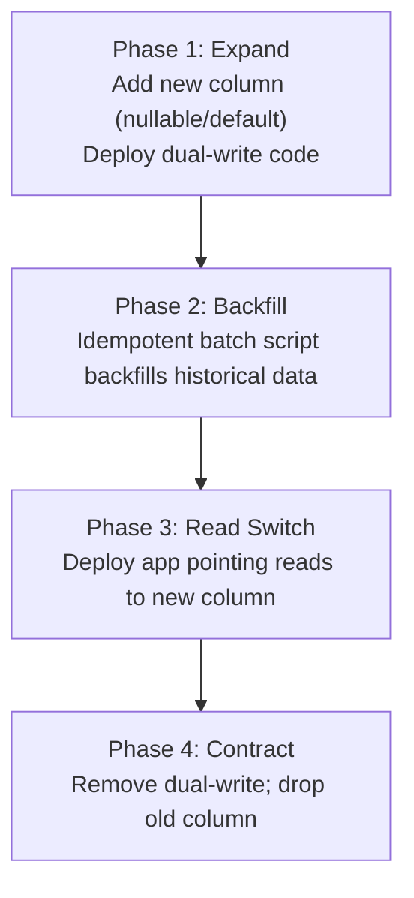

# Database Engineering & Performance Optimization

Production databases require strict empirical optimization. Never guess query performance; analyze execution plans, understand storage engine invariants, enforce deterministic locking, and execute migrations with zero downtime.

---

## 1. Indexing Strategy & B-Tree Optimization

### A. Composite Index Column Ordering Invariant
B-Trees evaluate composite index keys `(c1, c2, ..., cN)` strictly from left to right.
* **Rule 1: Equality First, Range Later**: Place columns used with equality (`=`, `IS NULL`) before columns used with range conditions (`<`, `>`, `<=`, `>=`, `BETWEEN`, `LIKE 'abc%'`). Once a range condition is evaluated on a column, subsequent columns in the index cannot be used for B-Tree point traversal.
  ```sql
  -- Query:
  SELECT * FROM orders WHERE tenant_id = 42 AND created_at >= '2026-01-01' AND status = 'COMPLETED';
  -- Optimal Index: Equality columns first (tenant_id, status), then range (created_at)
  CREATE INDEX idx_orders_tenant_status_created ON orders (tenant_id, status, created_at);
  ```
* **Rule 2: Selectivity vs Sort Alignment**:
  - If a query filters on equality and orders by another column: `WHERE tenant_id = ? ORDER BY created_at DESC LIMIT 20`, index `(tenant_id, created_at DESC)` allows the database to avoid an in-memory or disk `filesort` / `Sort` node entirely.
  - If a query filters on a range and orders by a different column, ordering cannot be satisfied by the index without a sort pass.

### B. Covering Indexes & Index-Only Scans
Eliminate heap/table page fetches by including all projection and filter columns within the index leaf pages.
* **PostgreSQL (`INCLUDE` clause)**: Leaf-only payload without bloating B-Tree internal navigation nodes.
  ```sql
  -- Index includes non-key columns in leaf pages:
  CREATE INDEX idx_users_email_covering ON users (email) INCLUDE (id, full_name, status);

  -- Results in Index Only Scan (Heap Fetches = 0 if Visibility Map is clean):
  SELECT id, full_name, status FROM users WHERE email = 'user@example.com';
  ```
* **MySQL / SQLite**: Append required columns to the composite key:
  ```sql
  CREATE INDEX idx_users_email_covering ON users (email, id, full_name, status);
  ```

### C. Partial / Filtered Indexes
Index only the subset of rows matching a deterministic predicate. Reduces index size, memory footprint, and write amplification.
* **Soft-Deleted Rows / Active State Filtering**:
  ```sql
  -- Index only active records (ignores 95% of table if historical/deleted):
  CREATE INDEX idx_active_subscriptions ON subscriptions (user_id) 
  WHERE deleted_at IS NULL AND status = 'ACTIVE';
  ```
* **Sparse / State Machine Queues**:
  ```sql
  -- Index only rows requiring processing:
  CREATE INDEX idx_pending_jobs ON job_queue (priority DESC, scheduled_at ASC) 
  WHERE status = 'PENDING';
  ```

### D. Expression & Functional Indexes
Index deterministic expressions to optimize computed queries without altering schema.
```sql
-- Case-insensitive lookup:
CREATE INDEX idx_users_lower_email ON users (LOWER(email));
-- Query must match expression exactly:
SELECT id FROM users WHERE LOWER(email) = 'alice@example.com';

-- JSONB field extraction (PostgreSQL):
CREATE INDEX idx_events_user_id ON events (((payload->>'user_id')::uuid));
```

### E. Index Anti-Patterns (SARGability Violations)
A query is **SARGable** (Search Argument Able) when the database engine can utilize index seeks rather than table/index full scans.
* ❌ **Wrapping indexed columns in functions**:
  `WHERE DATE(created_at) = '2026-09-01'` (Causes Full Table Scan)
  ✅ **Fix**: `WHERE created_at >= '2026-09-01 00:00:00' AND created_at < '2026-09-02 00:00:00'`
* ❌ **Leading wildcards**:
  `WHERE username LIKE '%smith'` (B-Tree cannot seek on suffix)
  ✅ **Fix**: Trigram index (`pg_trgm` via `GIN`) or reverse text index.
* ❌ **Implicit type coercion**:
  Comparing `VARCHAR` column with numeric literal (`WHERE phone_number = 123456`) forces runtime string conversion on every row.

---

## 2. Query Optimization & Execution Plan Analysis

### A. PostgreSQL `EXPLAIN (ANALYZE, BUFFERS)` Interpretation
Always run with `BUFFERS` to measure disk I/O vs cache hits.
```sql
EXPLAIN (ANALYZE, BUFFERS, VERBOSE, SETTINGS)
SELECT o.id, o.total_amount 
FROM orders o 
WHERE o.tenant_id = 100 AND o.status = 'PENDING';
```

| Node Type | Mechanism | Diagnostic Indicator |
| :--- | :--- | :--- |
| **Index Only Scan** | Data retrieved solely from B-Tree leaf pages. Visibility Map check prevents heap fetch. | Optimal path. `Heap Fetches: 0`. |
| **Index Scan** | B-Tree traverse -> direct pointer fetch from Table Heap per match. | Efficient for high selectivity (< 5-10% of table). |
| **Bitmap Index Scan + Bitmap Heap Scan** | Builds in-memory bitmap of matching pages, sorts page offsets, reads heap in physical sequential order. | Used for medium selectivity or multi-index `OR`/`AND` unions. |
| **Seq Scan (Table Scan)** | Reads every page in heap from start to finish. | Danger on large tables if unexpected. Verify missing index or low cardinality. |

**Key Execution Metrics**:
* `Buffers: shared hit=820 read=14`: `hit` is cache/buffer pool hits; `read` is physical disk I/O. Aim for 100% buffer hit ratio on hot paths.
* `Rows Removed by Filter`: High count indicates the index did not narrow rows early; composite index ordering or partial index needed.
* `actual time=startup..total`: Startup is time to first row; total is execution completion.

### B. MySQL `EXPLAIN ANALYZE` / `EXPLAIN FORMAT=TREE`
Evaluate join methods and scan types:
* `type: ALL` -> Full Table Scan.
* `type: index` -> Full Index Scan (iterates entire B-Tree leaves).
* `type: range` -> Index range seek (using `BETWEEN`, `<`, `>`, `IN`).
* `type: ref` / `eq_ref` -> Non-unique / Unique index lookup via equality.
* `type: const` -> Primary key / Unique index constant lookup (fastest).
* **Warning flags**: `Using temporary` (spilled to disk/memory temp table) and `Using filesort` (sort could not use B-Tree order).

### C. N+1 Query Elimination Patterns
* ❌ **Antipattern**: 1 query to fetch parent rows + $N$ individual queries for child rows inside an application loop.
* ✅ **Pattern 1: Batch IN Fetch**:
  ```sql
  -- 1. Fetch parents:
  SELECT id, name FROM departments WHERE active = true; -- returns IDs [1, 2, 3]
  -- 2. Fetch children in single round-trip:
  SELECT id, department_id, name FROM employees WHERE department_id IN (1, 2, 3);
  ```
* ✅ **Pattern 2: JSON Aggregation Subquery / Lateral Join (Single Roundtrip)**:
  ```sql
  SELECT 
    d.id, 
    d.name,
    COALESCE(
      (SELECT json_agg(json_build_object('id', e.id, 'name', e.name))
       FROM employees e 
       WHERE e.department_id = d.id), 
      '[]'::json
    ) AS employees
  FROM departments d
  WHERE d.active = true;
  ```

### D. Keyset (Cursor) Pagination vs Offset Overhead
* `OFFSET 100000 LIMIT 20` forces engine to read and discard 100,000 rows ($O(N)$ CPU and I/O cost).
* **Keyset Pagination ($O(1)$ constant seek time)**:
  ```sql
  -- Page 1:
  SELECT id, created_at, title FROM articles ORDER BY created_at DESC, id DESC LIMIT 20;
  -- Page 2 (pass last row's cursor: created_at = '2026-08-30 12:00:00', id = 4921):
  SELECT id, created_at, title 
  FROM articles 
  WHERE (created_at, id) < ('2026-08-30 12:00:00', 4921)
  ORDER BY created_at DESC, id DESC 
  LIMIT 20;
  ```

---

## 3. Concurrency Control, Isolation Levels & MVCC

### A. SQL Standard Isolation Levels & Anomalies

| Isolation Level | Dirty Read | Non-Repeatable Read | Phantom Read | Serialization Anomaly |
| :--- | :---: | :---: | :---: | :---: |
| **Read Uncommitted** | Possible | Possible | Possible | Possible |
| **Read Committed** (Default PG/MySQL default RC) | Prevented | Possible | Possible | Possible |
| **Repeatable Read** (Default MySQL InnoDB) | Prevented | Prevented | Prevented (PG/InnoDB MVCC) | Possible (Write Skew) |
| **Serializable** | Prevented | Prevented | Prevented | Prevented |

* **Read Committed**: Each statement inside a transaction sees a snapshot taken at the **start of that statement**.
* **Repeatable Read**: The entire transaction sees a snapshot taken at the **start of the transaction**.
* **Serializable (SSI)**: Enforces serial transaction execution order via predicate locking / conflict tracking. Aborts on conflict with `40001 serialization_failure` (application must retry).

### B. MVCC (Multi-Version Concurrency Control) Mechanics
* **PostgreSQL Tuple Visibility**:
  - Every row contains hidden system attributes: `xmin` (creating transaction ID), `xmax` (deleting/updating transaction ID), and `ctid` (physical block and offset).
  - Updates write a brand new tuple; old tuple is marked dead (`xmax = current_tx`).
  - **Vacuuming & Bloat**: Dead tuples consume storage until cleaned by `VACUUM`.
  - **Autovacuum Tuning Invariants**:
    ```ini
    autovacuum_vacuum_scale_factor = 0.05   # Trigger vacuum when 5% of rows are updated/dead
    autovacuum_vacuum_cost_limit = 2000     # Increase vacuum I/O budget
    autovacuum_max_workers = 4
    ```
* **MySQL InnoDB MVCC**:
  - Updates modify row in-place in Clustered Index (B+ Tree) and store historical delta versions in **Undo Log Segments** referenced by `DB_ROLL_PTR` and `DB_TRX_ID`.
  - Long-running read transactions prevent undo log purging, causing undo tablespace explosion.

### C. Locking & Deadlock Prevention
1. **Deterministic Lock Ordering**: Always acquire locks on multiple resources in the exact same deterministic order (e.g., sort primary keys ascending before locking):
   ```sql
   -- Consistent ordering across all code paths prevents AB-BA deadlocks:
   SELECT * FROM accounts WHERE id IN (14, 82) ORDER BY id FOR UPDATE;
   ```
2. **Lock Timeouts**: Prevent hung transactions from exhausting connection pools:
   ```sql
   SET lock_timeout = '2000ms';
   SET statement_timeout = '5000ms';
   ```
3. **Queue / Worker Concurrency (`SKIP LOCKED` & `NOWAIT`)**:
   ```sql
   -- Fetch and lock next available job without blocking other workers:
   WITH next_job AS (
     SELECT id 
     FROM job_queue 
     WHERE status = 'PENDING' 
     ORDER BY priority DESC, id ASC 
     LIMIT 1 
     FOR UPDATE SKIP LOCKED
   )
   UPDATE job_queue 
   SET status = 'PROCESSING', locked_at = NOW() 
   WHERE id = (SELECT id FROM next_job)
   RETURNING *;
   ```

---

## 4. Zero-Downtime Schema Migrations

### A. The Expand-and-Contract (Parallel Run) Pattern
Migrate active schemas supporting high-throughput production workloads without locks or downtime.



#### Step-by-Step Execution:
1. **Expand**: Add new column `new_col` (must be nullable or have a non-rewriting default). Deploy application version that writes to both `old_col` and `new_col`, but reads from `old_col`.
2. **Backfill**: Run asynchronous, throttled batch updater for existing rows:
   ```sql
   -- Batch script (e.g., 5,000 rows per transaction with sleep):
   UPDATE users 
   SET new_col = transform(old_col) 
   WHERE id > :last_id AND id <= :last_id + 5000 AND new_col IS NULL;
   ```
3. **Read Switch**: Deploy application version that reads from `new_col` and writes to `new_col` (and optionally `old_col` during canary).
4. **Contract**: Remove dual-write code. Drop `old_col`.

### B. Safe DDL Invariants (PostgreSQL / MySQL)

#### Safe Index Creation
* **PostgreSQL**: Standard `CREATE INDEX` takes an `AccessExclusiveLock` blocking all reads and writes.
  ```sql
  -- Non-blocking index creation:
  CREATE INDEX CONCURRENTLY idx_users_created_at ON users (created_at);
  -- Check for INVALID index status in case of failure:
  SELECT pg_class.relname FROM pg_class JOIN pg_index ON pg_class.oid = pg_index.indexrelid WHERE pg_index.indisvalid = false;
  ```
* **MySQL 8.0+ / InnoDB**:
  ```sql
  ALTER TABLE users ADD INDEX idx_users_created_at (created_at), ALGORITHM=INPLACE, LOCK=NONE;
  ```

#### Safe `NOT NULL` Addition on Existing Large Tables
* ❌ `ALTER TABLE orders ALTER COLUMN status SET NOT NULL;` (Scans whole table under table lock).
* ✅ **Safe Pattern (PostgreSQL)**:
  ```sql
  -- Step 1: Add check constraint without validating existing rows (instant):
  ALTER TABLE orders ADD CONSTRAINT check_orders_status_not_null CHECK (status IS NOT NULL) NOT VALID;
  
  -- Step 2: Validate constraint concurrently (does not block writes):
  ALTER TABLE orders VALIDATE CONSTRAINT check_orders_status_not_null;
  ```

#### Safe Column Drops
* ❌ Dropping a column immediately breaks running application instances executing cached `SELECT *` or prepared statements.
* ✅ **Safe Pattern**: Mark column ignored in ORM/Application layer -> Deploy -> `ALTER TABLE ... DROP COLUMN ...`.

---

## 5. Connection Pooling & SQLite WAL Mode

### A. Connection Pool Sizing (HikariCP / Postgres Invariant)
Allocating too many connections causes CPU thrashing, context-switching overhead, and disk contention.

$$\text{Optimal Pool Size} = (\text{CPU Cores} \times 2) + \text{Effective Spindle / Disk Count}$$

* For a server with 16 CPU cores and fast NVMe SSD storage: $\text{Pool Size} \approx (16 \times 2) + 1 = 33 \text{ connections}$.
* **PgBouncer Configuration**:
  - Use `pool_mode = transaction` for high scalability (thousands of application client connections mapped to a tight pool of backend Postgres connections).
  - Caveat: Prepared statements with session scope and advisory locks require `pool_mode = session` or named prepared statements support (`max_prepared_statements` in newer PgBouncer).

### B. SQLite WAL Mode & High-Performance Embedded Optimization
By default, SQLite uses rollback journal mode which locks the entire database for readers during writes. WAL (Write-Ahead Logging) enables concurrent readers alongside a single active writer.

#### Mandatory High-Throughput Pragmas
Execute these pragmas immediately on opening every SQLite connection:

```sql
-- 1. Enable Write-Ahead Logging (persists in db file header):
PRAGMA journal_mode = WAL;

-- 2. Relax disk sync safety (NORMAL is 100% crash-safe in WAL mode; eliminates fsync on every commit):
PRAGMA synchronous = NORMAL;

-- 3. Busy timeout: wait up to 5000ms instead of throwing SQLITE_BUSY instantly:
PRAGMA busy_timeout = 5000;

-- 4. In-memory page cache (negative number = kibibytes; -64000 = 64 MB):
PRAGMA cache_size = -64000;

-- 5. Memory-mapped I/O (256 MB): zero-copy reads bypassing OS buffer cache:
PRAGMA mmap_size = 268435456;

-- 6. Store temporary tables and indices in memory:
PRAGMA temp_store = MEMORY;

-- 7. Enforce foreign key constraints:
PRAGMA foreign_keys = ON;
```

#### SQLite Concurrency Model
* **Concurrency Rules**: Multiple readers can read concurrently while 1 writer writes to the WAL file.
* **Checkpointing**: By default, SQLite triggers automatic checkpoint when WAL reaches 1,000 pages. For write-heavy workloads, tune:
  ```sql
  PRAGMA wal_autocheckpoint = 10000;
  ```

---

## 6. Database Engineering Invariants Checklist

1. **Verify Before Deploying**: Always inspect `EXPLAIN (ANALYZE, BUFFERS)` on staging with production-scale data before deploying new queries.
2. **Never Query Without Limit in APIs**: Always enforce explicit `LIMIT` or keyset pagination.
3. **No Unindexed Foreign Keys**: Ensure child table foreign key columns have indexes to prevent full table locks during parent deletes/cascades.
4. **Enforce Statement & Lock Timeouts**: Set `statement_timeout` and `lock_timeout` globally or per-session to prevent runaway connection exhaustion.
5. **No `SELECT *` in Production**: Explicitly project required columns to maximize Index Only Scan eligibility.
6. **Concurrent DDL Only**: Never execute blocking `CREATE INDEX` or direct `ADD COLUMN ... NOT NULL DEFAULT <expr>` on high-traffic tables.
7. **Small, Controlled Transactions**: Keep transactions as short as possible. Do not execute external HTTP calls or heavy CPU work while holding an open database transaction.
