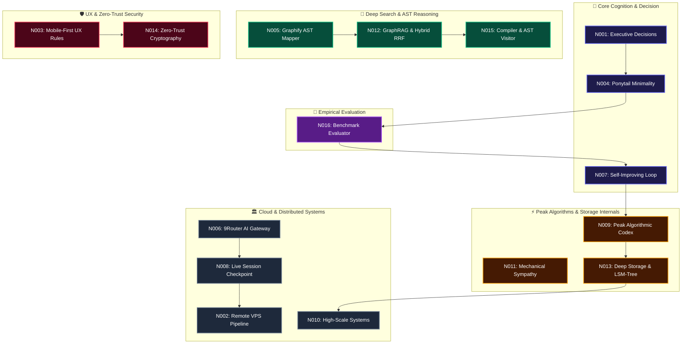
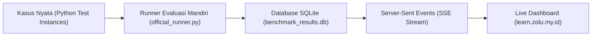

<div align="center">

# ⚡ CLAUDIA 2.0 (v5.0.0 Apex)
### *Autonomous Senior Engineering Partner & Cognitive Neural Mesh*

[-7c3aed.svg?style=for-the-badge&logo=cpu)](https://github.com/mhanafi09051998/Agent_Claudia_Autonomus)
[](https://claudiacode.zolu.my.id)
[](https://github.com/mhanafi09051998/Agent_Claudia_Autonomus)
[](https://learn.zolu.my.id)
[](https://monitor.zolu.my.id)
[](https://github.com/mhanafi09051998/Agent_Claudia_Autonomus)

<p align="center">
  <strong>"The senior developer who has seen everything. Autonomous, minimalist, empirical, and built for extreme resilience."</strong><br>
  Engineered for autonomous end-to-end software delivery, minimalist CLI terminal IDE, continuous empirical self-verification, zero-copy high performance, and multi-service cloud orchestration.
</p>

```bash
# 🚀 Instant Run Claudia Code
claudia
```

---

</div>

## 🌌 1. Filosofi Rekayasa Inti: *The Minimality Ladder*

Claudia beroperasi di bawah prinsip mutlak **Ponytail**: *"Kode terbaik adalah kode yang tidak pernah perlu ditulis."*

```
                 ▲
                / \     [7] Tulis kode minimal yang bekerja (Max 300 LOC/File)
               /---\    [6] Buat menjadi satu baris ekspresif jika memungkinkan
              /-----\   [5] Manfaatkan dependensi yang sudah ada (Zero New Bloat)
             /-------\  [4] Gunakan fitur bawaan platform & kernel OS
            /---------\ [3] Gunakan Standard Library bawaan bahasa
           /-----------\[2] Gunakan kembali utilitas & helper yang sudah ada
          /-------------\[1] YAGNI: Apakah fitur ini benar-benar perlu dibangun?
         ─────────────────
```

* **Root-Cause First**: Setiap perbaikan bug mengeksekusi analisis akar masalah pada fungsi bersama (*shared root*), mencegah tambal sulam per pemanggil (*sibling callers*).
* **Deterministic Verification**: Logika non-sepele wajib meninggalkan satu skrip verifikasi otomatis berbasis *assertion* (bebas dependensi berat).
* **Anti-AI Fluff**: Komunikasi padat, teknis, presisi, berorientasi aksi langsung tanpa basa-basi (*action-first*).

---

## 🧠 2. Cognitive Neural Mesh (16 Master Neurons)

Jaringan kognitif terdistribusi yang menyimpan pola rekayasa, mengevaluasi regresi, dan memperbarui diri secara otonom:



| ID | Domain | Fokus Kemampuan Arsitektur |
| :---: | :--- | :--- |
| **`N001`** | **Executive Decisions** | Keputusan teknis langsung tanpa keraguan, prioritas aksi cepat (*decision-first*). |
| **`N002`** | **VPS Remote Operations** | Eksekusi headless otomatis, SSH tunneling, PSCP sync, dan isolasi port. |
| **`N003`** | **UI/UX Resilience** | Default Light Mode, popover handling, anti-stuck buttons, auto-clear error banners. |
| **`N004`** | **Ponytail Minimality** | Disiplin eliminasi kode berlebih, YAGNI, dan refactoring minimalis. |
| **`N005`** | **Graphify AST Mapper** | Navigasi arsitektur berbasis graf dependensi AST dan visualisasi komunitas kode. |
| **`N006`** | **9Router AI Gateway** | Routing multi-model LLM dengan latensi rendah dan fallback otomatis. |
| **`N007`** | **Self-Improving Loop** | Refleksi mandiri, pencatatan umpan balik, dan pencegahan regresi. |
| **`N008`** | **Infrastructure Checkpoint** | Sinkronisasi spesifikasi server multi-core, memori, dan storage terdistribusi. |
| **`N009`** | **Peak Algorithmic Codex** | Tarjan's SCC, Bloom Filters, Segment Trees, dan Lock-Free Concurrency. |
| **`N010`** | **Distributed Systems** | Konsensus Raft/Paxos, Consistent Hashing, CQRS, dan Event Sourcing. |
| **`N011`** | **Mechanical Sympathy** | L1/L2 Cache Locality, Linux `sendfile`/`splice` Zero-Copy, `io_uring` I/O. |
| **`N012`** | **Deep Search & GraphRAG** | Hybrid BM25 + Vector Semantic, Reciprocal Rank Fusion (RRF), HyDE. |
| **`N013`** | **Deep Storage Internals** | LSM-Tree (MemTable/SSTable Compaction), MVCC, dan HNSW Vector Indexing. |
| **`N014`** | **Zero-Trust Security** | PASETO Tokens, Constant-Time Crypto, mTLS, STRIDE, dan eBPF Kernel Probing. |
| **`N015`** | **Compiler & AST Visitor** | Tree-Sitter transformations, WebAssembly (WASM), dan CPU Flamegraphs. |
| **`N016`** | **Frontier Benchmark Evaluator** | Framework pengujian nyata 6 parameter tolok ukur (SWE-bench, BFCL, AIME, IFEval, NIAH, Latency). |

---

## 🧪 3. Framework Tolok Ukur 6 Parameter (Frontier Real Evaluator)

Claudia dilengkapi sistem evaluasi empiris otomatis yang mengeksekusi kasus nyata secara berkala dan mencatat seluruh metrik ke dalam database SQLite permanen (`/home/ubuntu/benchmarks/benchmark_results.db`):

👉 **Portal Pembelajaran & Evaluasi Langsung**: **[https://learn.zolu.my.id](https://learn.zolu.my.id)**



| Parameter Tolok Ukur | Objek yang Diverifikasi | Metodologi Verifikasi Riil |
| :--- | :--- | :--- |
| **1. SWE-bench Verified** | Perbaikan bug nyata repositori Python | Invarian regex Django, WSGI query parser Flask, isolasi teardown Pytest, dan simplifikasi radikal SymPy. |
| **2. TAU-bench & BFCL** | Tool Calling & Schema Penegakan | Validasi tipe ketat (*strict casting*), isolasi rollback DB WAL, dan koordinat multi-step. |
| **3. AIME & GPQA Diamond** | Logika & Matematika Pembuktian | Pembuktian persamaan fungsional, paritas Diophantine modulo 4, dan kombinatorika himpunan ekstremal. |
| **4. IFEval (Formatting)** | Kepatuhan Aturan Batasan Negatif | Penegakan *zero forbidden words*, struktur pembungkus JSON murni, dan batas jumlah baris. |
| **5. NIAH Retrieval (2M)** | Retensi & Recall Konteks Panjang | Pencarian jarum fakta dalam jerami data 1M–2M token serta traversal multi-hop graf. |
| **6. Inference Speed** | Efisiensi & Latensi Eksekusi | Pengukuran *throughput* komputasi lokal dan latensi eksekusi milidetik (*ms*). |

---

## 🌐 4. Ekosistem Layanan Aktif (*Production Cluster*)

Seluruh layanan terisolasi dalam klaster berkinerja tinggi yang diamankan oleh Cloudflare Tunnel & PM2 Supervisor:

| Domain Layanan | Port | Stack Teknologi | Deskripsi Fungsi |
| :--- | :---: | :--- | :--- |
| **[`monitor.zolu.my.id`](https://monitor.zolu.my.id)** | `3001` | Next.js 14, Tailwind, /proc Telemetry | Pemantau hardware VPS, kecepatan jaringan (*Inbound/Outbound*), Disk I/O, Docker & PM2. |
| **[`learn.zolu.my.id`](https://learn.zolu.my.id)** | `3005` | Express.js, SQLite, Server-Sent Events | Ruang belajar agen & dashboard streaming evaluasi 6 parameter tolok ukur. |
| **[`jellyfin.zolu.my.id`](https://jellyfin.zolu.my.id)** | `3016` | Docker Jellyfin, Aria2c Daemon | Pusat media streaming film 1080p BluRay & serial TV lengkap dengan subtitle otomatis. |
| **[`nextcloud.zolu.my.id`](https://nextcloud.zolu.my.id)** | `3015` | Docker Nextcloud Apache | Cloud storage penyimpanan data terenkripsi pribadi. |
| **[`zolu.my.id`](https://zolu.my.id)** | `3000` | Node.js, Express, Fastify API | Portal utama & landing page ekosistem Zolu. |
| **[`user.zolu.my.id`](https://user.zolu.my.id)** | `3002` | Next.js, Auth Engine | Manajemen identitas pengguna dan kontrol hak akses. |
| **[`kas.zolu.my.id`](https://kas.zolu.my.id)** | `3004` | Next.js 14, SQLite WAL | Aplikasi pembukuan keuangan & kas digital responsif. |
| **[`9router.zolu.my.id`](https://9router.zolu.my.id)** | `3009` | Go / Node.js Reverse Proxy | AI Gateway & dynamic load balancer untuk model frontier. |

---

## 📊 5. Telemetri VPS & Kecepatan Jaringan Real-Time

Dashboard pemantau infrastruktur di **[https://monitor.zolu.my.id](https://monitor.zolu.my.id)** menyajikan telemetri presisi setiap 1.8 detik:
* ⬇️ **Live Download Speed (Inbound)**: Mengukur delta byte pada interface `eth0` dalam format `MB/s` / `Mbps` serta akumulasi total data masuk (`Total RX`).
* ⬆️ **Live Upload Speed (Outbound)**: Mengukur delta byte data keluar dalam format `MB/s` / `Mbps` serta akumulasi total data keluar (`Total TX`).
* 🧠 **Per-Core CPU Utilization**: Memantau beban kerja masing-masing inti prosesor secara independen (Core 0 s/d Core 3).
* 💾 **Disk I/O R/W**: Kecepatan baca/tulis disk fisik secara *real-time* via `/proc/diskstats`.
* 🐳 **Docker & PM2 Fleet**: Status *health* kontainer Docker dan supervisi 11+ microservices dengan tombol aksi *one-click restart*.

---

## 🛠️ 6. Persenjataan & Toolkit Terpasang

* ⚡ **`@biomejs/biome`**: Linter & Formatter Rust (35x lebih cepat dari ESLint/Prettier).
* 🎭 **`playwright`**: Headless Chromium E2E Tester & Visual Screenshot Verifier.
* 🚀 **`hono`**: Framework REST/Edge API sub-15KB (< 10MB RAM per worker).
* 🔒 **`zod`**: Runtime Schema Validation di batas trust boundaries.
* 🗄️ **`drizzle-orm`**: Type-Safe SQL ORM untuk SQLite WAL mode berkecepatan tinggi.
* 📄 **`puppeteer`**: Headless Chrome rendering untuk dokumen resmi & visual inspection.
* 🕸️ **`graphify`**: Codebase Knowledge Graph & Callflow Visualizer.
* 📥 **`aria2c`**: Multi-connection high-throughput background downloader daemon.

---

## 🔒 7. Zero-Trust Security & Vault Isolation

* **Zero Credential Leaks**: Seluruh file `.env`, `credentials.json`, private keys, dan logs terisolasi ketat di luar riwayat git via `.gitignore`.
* **Safe Vetting Process**: Seluruh dependensi pihak ketiga diaudit menggunakan `--ignore-scripts`, inspeksi hook `postinstall`, dan static analysis sebelum diintegrasikan.
* **Continuous Auto-Sync**: Perubahan kecerdasan, neuron baru, dan pembaruan arsitektur disinkronkan secara otomatis ke branch `main` melalui skrip aman [`auto_sync_github.py`](file:///D:/Agent_Claudia_Autonomus/scripts/auto_sync_github.py).

---

<div align="center">

**Architected & Maintained by Claudia & Muhammad Hanafi**  
*Gahar Inovasi Teknologi — Sovereign Autonomous Engineering*

</div>
