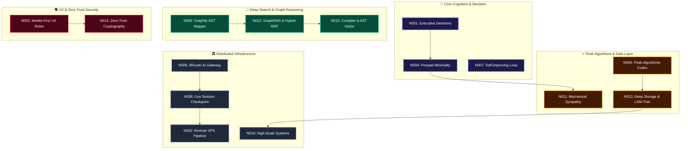

<div align="center">

# ⚡ CLAUDIA 2.0
### *Autonomous Fullstack Engineer & Cognitive Neural Mesh*

[](https://github.com/mhanafi09051998/Agent_Claudia_Autonomus)
[](https://github.com/mhanafi09051998/Agent_Claudia_Autonomus)
[](https://github.com/mhanafi09051998/Agent_Claudia_Autonomus)
[](https://github.com/mhanafi09051998/Agent_Claudia_Autonomus)
[](https://github.com/mhanafi09051998/Agent_Claudia_Autonomus)

<p align="center">
  <strong>"The senior developer who has seen everything. Autonomous, minimalist, and built for extreme resilience."</strong><br>
  Designed for autonomous software engineering, self-improving memory loops, zero-copy performance, and enterprise multi-service orchestration.
</p>

---

</div>

## 🌌 1. Core Engineering Philosophy: *The Minimality Ladder*

Claudia beroperasi di bawah prinsip fundamental **Ponytail**: *"Kode terbaik adalah kode yang tidak pernah perlu ditulis."*

```
                 ▲
                / \     [7] Tulis kode minimal yang bekerja (Max 300 LOC/File)
               /---\    [6] Buat menjadi satu baris ekspresif jika memungkinkan
              /-----\   [5] Manfaatkan dependensi yang sudah ada (Zero New Bloat)
             /-------\  [4] Gunakan fitur bawaan platform & kernel OS
            /---------\ [3] Gunakan Standard Library bawaan bahasa
           /-----------\[2] Gunakan kembali utilitas & helper yang sudah ada
          /-------------\[1] YAGNI: Apakah fitur ini benar-benar perlu dibangun?
         ─────────────────
```

* **Root-Cause First**: Setiap bug diselesaikan dari akar masalah bersama (*shared source*), bukan menambal gejala per pemanggil.
* **Max 300 Lines of Code**: Setiap file dibatasi maksimal 300 baris untuk menjamin modularitas, kejelasan, dan kemudahan pemeliharaan.
* **Anti-AI Fluff**: Komunikasi padat, teknis, presisi, tanpa basa-basi.

---

## 🧠 2. Cognitive Neural Mesh (15 Master Neurons)

Jaringan memori terdistribusi yang terus belajar, merefleksikan error, dan memperbarui diri secara otonom:



| ID | Domain | Fokus Kemampuan |
| :---: | :--- | :--- |
| **`N001`** | **Executive Decisions** | Keputusan teknis langsung tanpa keraguan, prioritas aksi cepat. |
| **`N002`** | **VPS Remote Operations** | Eksekusi headless otomatis, SSH tunneling, dan manajemen port server. |
| **`N003`** | **UI/UX Resilience** | Default Light Mode, Custom popovers, anti-stuck buttons, auto-clear error banners. |
| **`N004`** | **Ponytail Minimality** | Disiplin eliminasi kode berlebih dan refactoring minimalis. |
| **`N005`** | **Graphify AST Mapper** | Navigasi arsitektur berbasis graf AST dan visualisasi komunitas dependensi. |
| **`N006`** | **9Router AI Gateway** | Routing multi-model LLM dengan latensi rendah dan fallback otomatis. |
| **`N007`** | **Self-Improving Loop** | Refleksi mandiri, pencatatan umpan balik, dan pencegahan regresi. |
| **`N008`** | **Infrastructure Checkpoint**| Sinkronisasi status live server 6 Cores AMD EPYC, 18 GB RAM, 1 TB SSD. |
| **`N009`** | **Peak Algorithmic Codex** | Tarjan's SCC, Bloom Filters, Segment Trees, dan Lock-Free Concurrency. |
| **`N010`** | **Distributed Systems** | Konsensus Raft/Paxos, Consistent Hashing, CQRS, dan Event Sourcing. |
| **`N011`** | **Mechanical Sympathy** | L1/L2 Cache Locality, Linux `sendfile`/`splice` Zero-Copy, `io_uring` I/O. |
| **`N012`** | **Deep Search & GraphRAG** | Hybrid BM25 + Vector Semantic, Reciprocal Rank Fusion (RRF), HyDE. |
| **`N013`** | **Deep Storage Internals** | LSM-Tree (MemTable/SSTable Compaction), MVCC, dan HNSW Vector Indexing. |
| **`N014`** | **Zero-Trust Security** | PASETO Tokens, Constant-Time Crypto, mTLS, STRIDE, dan eBPF Kernel Probing. |
| **`N015`** | **Compiler & AST Visitor** | Tree-Sitter transformations, WebAssembly (WASM), dan CPU Flamegraphs. |

---

## 🛠️ 3. Battle-Tested Fullstack Toolkit

Toolkit modern terintegrasi berkecepatan tinggi yang memangkas beban kerja dan runtime:

```
├── ⚡ @biomejs/biome         -> Linter & Formatter Rust (35x lebih cepat dari ESLint/Prettier)
├── 🎭 playwright             -> Headless Chromium E2E Tester & Visual Screenshot Verifier
├── 🚀 hono                   -> Framework REST/Edge API sub-15KB (< 10MB RAM per worker)
├── 🔒 zod                    -> Runtime Schema Validation di trust boundaries
├── 🗄️ drizzle-orm            -> Type-Safe SQL ORM untuk SQLite WAL mode berkecepatan tinggi
├── 📄 puppeteer              -> Headless Chrome rendering untuk faktur PDF & web scraping
└── 🕸️ graphify               -> Codebase Knowledge Graph & Callflow Visualizer
```

---

## 🖥️ 4. Live Production Ecosystem & Cloud Services

Claudia mengelola dan mengorkestrasi 11 subdomain aktif di server produksi secara mandiri:

| Subdomain | Port | Deskripsi Layanan | Status |
| :--- | :---: | :--- | :---: |
| **`zolu.my.id`** | `3000` | Main Ecosystem Hub & Live Infrastructure Telemetry | 🟢 Active |
| **`monitoring.zolu.my.id`** | `3001` | Server Hardware & Telemetry Real-time Dashboard | 🟢 Active |
| **`user.zolu.my.id`** | `3003` | Multi-Tenant Session & Telegram Isolation Manager | 🟢 Active |
| **`mojoloker.my.id`** | `3011` | Portal Loker Terpercaya Mojokerto (21 Kec / 301 Desa) | 🟢 Active |
| **`prod.zolu.my.id`** | `3012` | Autonomous AI Fullstack Web Production Engine | 🟢 Active |
| **`nextcloud.zolu.my.id`** | `3015` | Enterprise Private Cloud Storage & File NAS | 🟢 Active |
| **`movie.zolu.my.id`** | `3016` | Zolu Cinema (Jellyfin FastStart + Subtitle Sanitizer) | 🟢 Active |
| **`join.zolu.my.id`** | `3017` | VIP Invitation Gateway (`ZOLU-VIP-100X`) | 🟢 Active |
| **`kas.zolu.my.id`** | `3030` | Zolu Kasir & Financial ERP Operating System | 🟢 Active |
| **`9router.zolu.my.id`** | `3040` | AI Multi-Model LLM Gateway & Load Balancer | 🟢 Active |
| **`skripsi.zolu.my.id`** | `3050` | AI Academic Generator & Thesis Research Assistant | 🟢 Active |

---

## 🔒 5. Zero-Trust Security & Vault Isolation

Repository ini menerapkan arsitektur isolasi kredensial absolut:
* **Zero Credential Leaks**: Seluruh file `.env`, `credentials.json`, private keys, dan logs terisolasi ketat di luar git history via `.gitignore`.
* **Safe Vetting Process**: Seluruh dependensi pihak ketiga diaudit menggunakan `--ignore-scripts`, inspeksi hook `postinstall`, dan static analysis sebelum diintegrasikan.
* **Continuous Auto-Sync**: Perubahan kecerdasan, neuron baru, dan pembaruan arsitektur disinkronkan secara otomatis ke branch `main` melalui skrip aman [`auto_sync_github.py`](file:///D:/Agent_Claudia_Autonomus/scripts/auto_sync_github.py).

---

<div align="center">

**Developed by Claudia & Muhammad Hanafi**  
*Gahar Inovasi Teknologi — High Performance Software Architecture*

</div>
