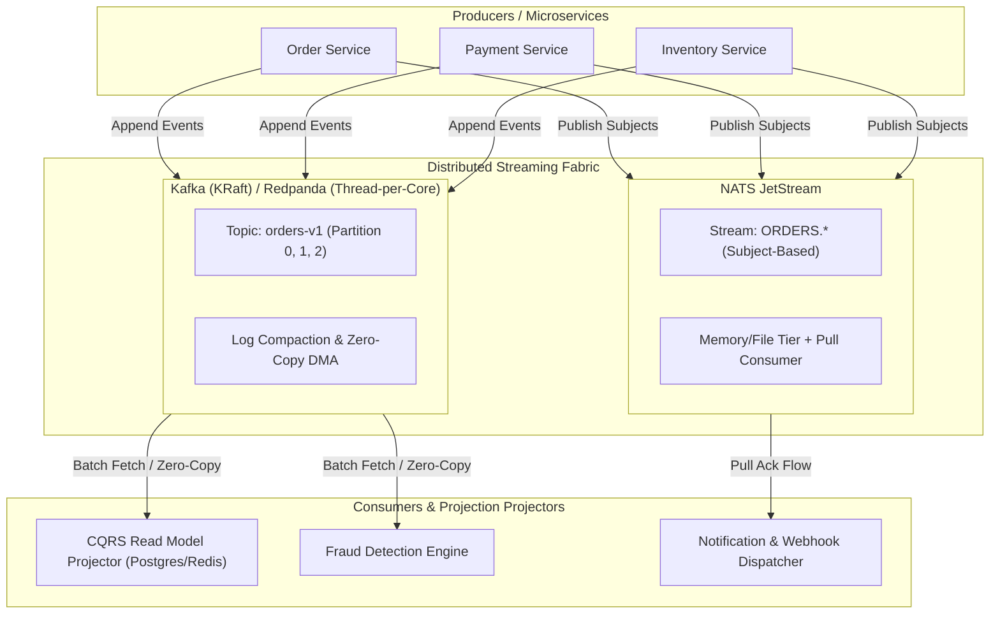
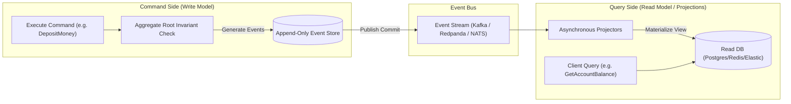
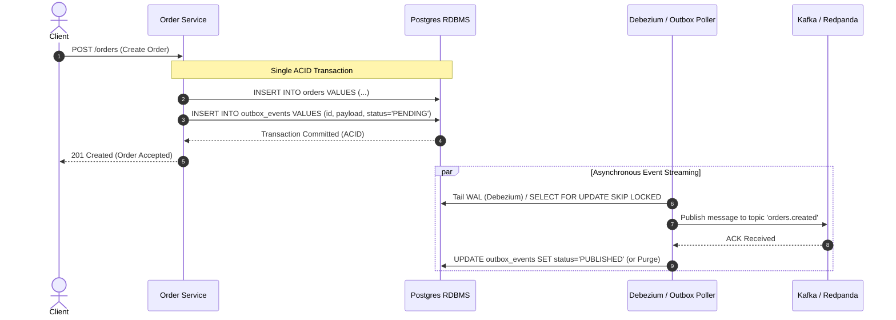
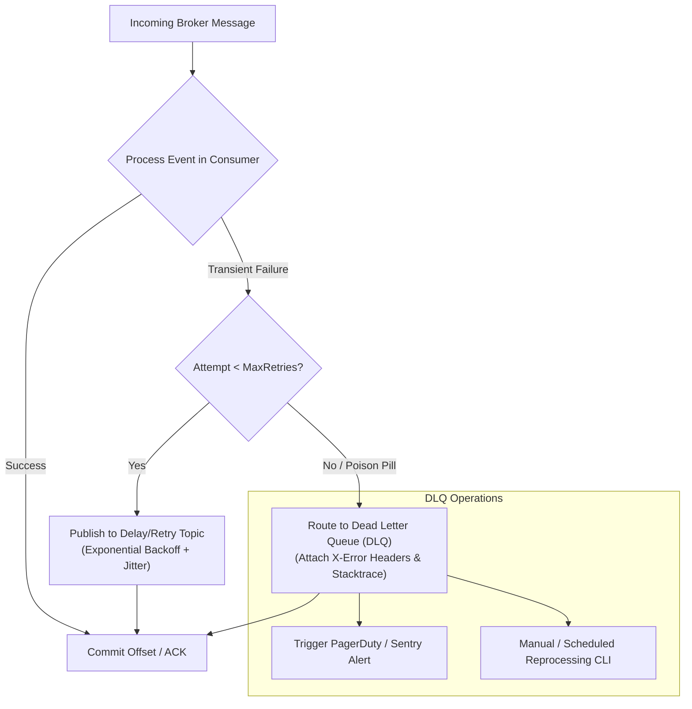

# Neuron N035: Ultra-Scale Event-Driven Streaming & CQRS Architecture

Prinsip perancangan arsitektur event-driven skala masif, engine distributed streaming (Apache Kafka, Redpanda, NATS JetStream), pemisahan domain mutasi & baca via CQRS, immutable event sourcing, jaminan konsistensi transaksional via Transactional Outbox Pattern, isolasi kegagalan via Dead Letter Queues (DLQ), dan jaminan deduplikasi pemrosesan via Idempotent Consumers:

- **Kategori**: Distributed Event Streaming, Message Brokers, Event Sourcing & CQRS
- **Tanggal Sintesis**: 2026-08-24
- **Subgoal**: Merancang arsitektur event streaming berkinerja ultra-tinggi dengan latensi p99 rendah dan throughput jutaan pesan/detik, mengeliminasi dual-write hazard melalui Transactional Outbox & CDC, memisahkan model write dan read secara asinkron via CQRS dan Event Sourcing, mengisolasi poison pills menggunakan Multi-Tier DLQ, serta menjamin pemrosesan exactly-once secara semantik melalui Idempotent Consumer patterns.
- **Synaptic Links**: [`N004`](file:///D:/Agent_Claudia_Autonomus/learning/neurons/N004_ponytail_minimality.md), [`N009`](file:///D:/Agent_Claudia_Autonomus/learning/neurons/N009_peak_algorithms_codex.md), [`N010`](file:///D:/Agent_Claudia_Autonomus/learning/neurons/N010_distributed_systems_design.md), [`N011`](file:///D:/Agent_Claudia_Autonomus/learning/neurons/N011_mechanical_sympathy_perf.md), [`N013`](file:///D:/Agent_Claudia_Autonomus/learning/neurons/N013_deep_storage_and_distributed_db.md), [`N028`](file:///D:/Agent_Claudia_Autonomus/learning/neurons/N028_autonomous_self_healing_chaos.md), [`N029`](file:///D:/Agent_Claudia_Autonomus/learning/neurons/N029_modern_systems_rust_go.md), [`N031`](file:///D:/Agent_Claudia_Autonomus/learning/neurons/N031_modern_data_storage_pgvector.md)
- **Status**: Active Operational Invariant

---

## 🚀 1. Modern Streaming Engine Mechanics: Kafka vs. Redpanda vs. NATS JetStream

Pemilihan message streaming engine harus disesuaikan dengan profil hardware, target latensi, dan model konsistensi data.



### A. Apache Kafka (KRaft Metadata & Zero-Copy Transfer)
1. **Commit Log & Partitioning Invariant**:
   - Data ditulis secara *append-only* ke dalam file segmen disk berurutan (`.log`) yang dipetakan dengan sparse offset index (`.index`) dan time index (`.timeindex`).
   - Penulisan sequential disk I/O mengeksploitasi throughput disk maksimum ($>500\text{ MB/s}$ pada NVMe) tanpa overhead random seek.
2. **OS Page Cache & `sendfile()` Zero-Copy**:
   - Kafka memanfaatkan Linux Page Cache alih-alih buffer heap JVM internal, menghindari overhead alokasi objek dan garbage collection (GC) pauses.
   - Pengiriman data ke network socket menggunakan system call Linux `sendfile()` / DMA (Direct Memory Access):
     $$\text{Disk} \xrightarrow{\text{DMA}} \text{Page Cache} \xrightarrow{\text{Socket Buffer Descriptor}} \text{NIC Buffer} \xrightarrow{} \text{Network}$$
     *Zero CPU memory copy* dari kernel space ke user space.
3. **Consumer Group Rebalancing**:
   - Gunakan **Cooperative Sticky Assignor** (`org.apache.kafka.clients.consumer.CooperativeStickyAssignor`) untuk menghindari *stop-the-world eager rebalances* saat consumer baru bergabung atau mati. Rebalance dilakukan secara inkremental tanpa menghentikan partisi yang tidak berpindah.

### B. Redpanda (C++20, Seastar Thread-per-Core, Direct I/O)
1. **Thread-per-Core & Hardware Pinning**:
   - Redpanda dibangun menggunakan Seastar framework di mana setiap thread CPU dipasangi (*pinned*) satu core khusus tanpa shared memory lock contention antar thread.
2. **Direct I/O (`O_DIRECT`)**:
   - Memotong OS Page Cache sepenuhnya. Redpanda mengelola buffer memori DMA sendiri, mengeliminasi lock page cache di kernel Linux dan memangkas p99/p99.9 tail latency hingga $<5\text{ ms}$ konstan di bawah beban tinggi.
3. **Built-in Raft per Partition**:
   - Eliminasi ZooKeeper / KRaft controller eksternal terpisah. Setiap partisi adalah satu grup Raft mandiri yang dikelola langsung di level core.

### C. NATS JetStream (Go-Native, Subject-Based Routing, Ultra-Lightweight)
1. **Subject Hierarchy & Stream Overlays**:
   - Menggunakan model hierarki subject (misal: `orders.us.created`, `orders.eu.paid`) dengan wildcard subscription (`orders.*.created`, `orders.>`).
2. **Pull Consumer Backpressure Control**:
   - Consumer melakukan batch pull eksplisit (`Fetch(batch_size, timeout)`), menjamin consumer tidak akan pernah kebanjiran memori (*OOM*) saat downstream database melambat.
3. **Low Footprint & Edge Deployment**:
   - Single binary $<50\text{ MB}$, konsumsi RAM awal $<30\text{ MB}$, sangat ideal untuk arsitektur edge-to-cloud, hybrid IoT, dan microservices berkecepatan tinggi.

### D. Architectural Engine Matrix

| Karakteristik | Apache Kafka (KRaft) | Redpanda | NATS JetStream |
| :--- | :--- | :--- | :--- |
| **Runtime Language** | Java / Scala (JVM) | C++20 (Seastar) | Go |
| **Memory Management** | OS Page Cache + JVM Heap | Direct I/O (`O_DIRECT`), Zero OS Page Cache | Native Go Runtime Heap / Mmap |
| **Tail Latency (p99)** | $15 - 50\text{ ms}$ (Tergantung GC & I/O) | $2 - 5\text{ ms}$ (Deterministik) | $1 - 3\text{ ms}$ (Ultra-low) |
| **Throughput Ceiling** | Sangat Tinggi ($>1\text{M msg/s}$) | Sangat Tinggi ($>1.5\text{M msg/s}$) | Tinggi ($>500\text{K msg/s}$) |
| **Message Ordering** | Per-Partition Strict Order | Per-Partition Strict Order | Per-Subject / Stream Strict Order |
| **Routing Flexibility** | Partisi statis per Topic | Partisi statis per Topic | Dynamic Subject Wildcards (`*`, `>`) |
| **Operational Overhead** | Sedang - Tinggi | Sangat Rendah (Single Binary) | Sangat Rendah (Single Binary) |

---

## 🏛️ 2. CQRS & Event Sourcing Architecture

Memisahkan mutasi status (Command) dari query data (Query) dengan menjadikan **immutable events** sebagai satu-satunya *source of truth*.



### A. State as a Left Fold over Immutable Events
Status dari suatu entitas/agregat pada waktu $t$ merupakan hasil komputasi *deterministic fold* dari state awal $S_0$ terhadap rentetan event yang telah terjadi:

$$S_t = \text{foldl}\left(\text{apply\_event}, S_0, [e_1, e_2, \dots, e_t]\right)$$

- **Immutabilitas**: Sekali dicatat di Event Store, event tidak boleh diubah (`UPDATE`) atau dihapus (`DELETE`). Koreksi bisnis dicatat sebagai *compensating event* baru.
- **Audit Trail Alami**: Riwayat perubahan status terekam $100\%$ secara historis tanpa kehilangan konteks bisnis (*who, what, when, why*).

### B. Aggregate Root & Optimistic Concurrency Control (OCC)
1. **Invariant Enforcement**:
   - Command tidak mengubah database secara langsung. Command divalidasi terhadap state in-memory agregat untuk memastikan tidak ada aturan domain yang dilanggar (contoh: saldo tidak boleh negatif).
2. **Version Checking Invariant**:
   - Setiap mutasi memeriksa versi event saat ini (`expected_version`).
   - Jika `current_version != expected_version` pada saat `append_events`, transaksi ditolak dengan `ConcurrencyException` dan client diminta melakukan *retry with reloaded state*.

### C. Snapshotting Invariant
Jika sebuah agregat memiliki ribuan event, rekonsiliasi state dari awal menjadi lambat ($O(N)$ event replay).
- **Snapshot Policy**: Buat snapshot status terkompresi setiap $K$ event (misal: $K = 100$).
- **Rehydration Invariant**:
  $$S_{\text{current}} = \text{foldl}\left(\text{apply\_event}, \text{Snapshot}_k, [e_{k+1}, \dots, e_{\text{current}}]\right)$$
  Memotong waktu rehydrasi kembali menjadi $O(1)$ amortized.

---

## 📦 3. Transactional Outbox Pattern & CDC Invariant

### A. The Dual-Write Hazard
Menyimpan data ke Database lalu mem-publish event ke Message Broker secara terpisah adalah anti-pattern fatal:
```text
[HTTP Request]
   ├── 1. db.save(order)      ---> [SUCCESS]
   └── 2. broker.publish(evt) ---> [NETWORK CRASH / BROKER TIMEOUT!]
                                   ==> Database tersimpan, tapi event hilang selamanya! (State Inconsistency)
```

Distributed 2PC (Two-Phase Commit / XA Transactions) tidak praktis dan memiliki performa buruk di cloud-native systems. Solusi standar industri adalah **Transactional Outbox Pattern**.



### B. Outbox Schema Invariant (PostgreSQL DDL)
```sql
CREATE TABLE outbox_events (
    id UUID PRIMARY KEY DEFAULT gen_random_uuid(),
    aggregate_type VARCHAR(64) NOT NULL,
    aggregate_id VARCHAR(128) NOT NULL,
    event_type VARCHAR(128) NOT NULL,
    payload JSONB NOT NULL,
    headers JSONB DEFAULT '{}'::jsonb,
    status VARCHAR(32) NOT NULL DEFAULT 'PENDING',
    created_at TIMESTAMPTZ NOT NULL DEFAULT NOW()
);

-- Indeks performa untuk polling publisher dengan skip locked
CREATE INDEX idx_outbox_pending ON outbox_events (created_at) 
WHERE status = 'PENDING';
```

### C. Reliable Outbox Dispatch Patterns
1. **Log-based CDC (Change Data Capture - Debezium / pgoutput)**:
   - Debezium membaca stream WAL PostgreSQL secara asinkron tanpa query polling ke database, meneruskan record langsung ke Kafka topic. Zero overhead pada query engine.
2. **Polling Publisher with `SKIP LOCKED`**:
   - Jika CDC engine eksternal tidak tersedia, gunakan query lock-free polling:
     ```sql
     SELECT id, aggregate_type, aggregate_id, event_type, payload, headers
     FROM outbox_events
     WHERE status = 'PENDING'
     ORDER BY created_at ASC
     LIMIT 100
     FOR UPDATE SKIP LOCKED;
     ```
   - Multi-worker poller dapat memproses batch secara paralel tanpa mengalami deadlock atau contention.

---

## 🛡️ 4. Resilient Delivery, Poison Pill Isolation & Multi-Tier DLQ

### A. Klasifikasi Error
1. **Transient Errors (Dapat di-retry)**:
   - Database connection timeout, network packet drop, lock contention, downstream HTTP 503/429.
   - Penanganan: Retry dengan Exponential Backoff + Full Jitter.
2. **Permanent / Non-Retryable Errors (Poison Pills)**:
   - Payload JSON korup, skema event tidak kompatibel (*deserialization failure*), invalid business assertion.
   - Penanganan: Isolasi seketika ke Dead Letter Queue (DLQ) untuk mencegah *Head-of-Line (HoL) Blocking* pada partisi Kafka.



### B. Multi-Tier Retry & Exponential Backoff Invariant
Rumus penundaan retry dengan *Full Jitter* untuk mencegah *Thundering Herd Problem*:

$$t_{\text{sleep}} = \text{random}\left(0, \min\left(t_{\text{max}}, t_{\text{base}} \times 2^{\text{attempt}}\right)\right)$$

- Gunakan topic retry berjenjang (`topic.retry.1`, `topic.retry.2`, `topic.retry.3`) daripada memblokir thread consumer dengan `sleep()` lokal yang dapat memicu consumer group rebalance/heartbeat timeout.

---

## 🔑 5. End-to-End Idempotency & Deduplication Invariants

### A. Realitas At-Least-Once Delivery
Dalam sistem terdistribusi, kegagalan jaringan saat pengiriman ACK dapat menyebabkan pesan yang sama dikirim ulang oleh broker (*At-Least-Once Delivery*). Setiap consumer **wajib** idempoten.

### B. 3 Strategi Idempotensi Consumer
1. **Natural Idempotency**:
   - Operasi yang secara alami bernilai sama jika dieksekusi berulang kali (misal: `UPDATE accounts SET status = 'CANCELLED' WHERE id = ?`).
2. **Idempotency Key Tracking (Atomic Deduplication Table)**:
   - Setiap pesan membawa atribut unik `idempotency_key` atau kombinasi `(event_id, consumer_group)`.
   - Consumer mencatat `idempotency_key` dalam transaksi yang sama dengan modifikasi data:
     ```sql
     INSERT INTO processed_events (message_id, consumer_group, processed_at)
     VALUES ($1, $2, NOW())
     ON CONFLICT (message_id, consumer_group) DO NOTHING;
     ```
   - Jika row tidak bertambah (`rows_affected == 0`), lewati mutasi bisnis dan langsung kirimkan ACK ke broker.
3. **Sliding Window Bloom Filter Cache**:
   - Gunakan Redis string bitfield / Bloom filter untuk deduplikasi cepat di layer RAM sebelum verifikasi disk database.

---

## 🧪 6. Invariant Self-Check Executable (Pure Python Standard Library)

Skrip verifikasi mandiri komprehensif tanpa dependensi pihak ketiga (Pure Python 3.10+ Standard Library) yang menguji:
1. **Event Sourcing Aggregate & OCC**: Rehydration, state projection, snapshotting, dan deteksi konflik konkurensi versi.
2. **Transactional Outbox & CDC**: Atomisitas penulisan state + outbox dan diseminasi reliable ke broker.
3. **Idempotent Consumer & Deduplication**: Penolakan duplikasi pesan tanpa efek samping mutasi ganda.
4. **Multi-Tier Retry & Poison Pill DLQ Isolation**: Isolasi kegagalan ke Dead Letter Queue tanpa memblokir antrean utama.

```python
"""
Neuron N035 Invariant Self-Check:
Event Sourcing, CQRS Read Projections, Transactional Outbox Pattern,
Idempotent Consumer Deduplication, and Multi-Tier DLQ Isolation.
Zero external dependencies (Pure Python 3.10+ Standard Library).
"""
import sys
import time
import json
import uuid
import math
import random
from dataclasses import dataclass, field, asdict
from typing import List, Dict, Any, Optional, Set

if sys.platform == "win32":
    sys.stdout.reconfigure(encoding="utf-8")
    sys.stderr.reconfigure(encoding="utf-8")

# -------------------------------------------------------------
# 1. Event Sourcing & CQRS Command Aggregate
# -------------------------------------------------------------

@dataclass(frozen=True)
class Event:
    event_id: str
    aggregate_id: str
    event_type: str
    version: int
    payload: Dict[str, Any]
    timestamp: float

@dataclass
class AccountSnapshot:
    aggregate_id: str
    version: int
    balance: float
    is_closed: bool

class BankAccountAggregate:
    """Aggregate Root Domain: Menegakkan aturan bisnis dan memproduksi immutable events."""
    def __init__(self, account_id: str):
        self.account_id: str = account_id
        self.balance: float = 0.0
        self.is_closed: bool = False
        self.version: int = 0
        self.uncommitted_events: List[Event] = []

    def apply(self, event: Event):
        if event.event_type == "AccountOpened":
            self.balance = float(event.payload["initial_balance"])
            self.is_closed = False
        elif event.event_type == "MoneyDeposited":
            self.balance += float(event.payload["amount"])
        elif event.event_type == "MoneyWithdrawn":
            self.balance -= float(event.payload["amount"])
        elif event.event_type == "AccountClosed":
            self.is_closed = True
        self.version = event.version

    def open(self, initial_balance: float):
        if self.version > 0:
            raise ValueError("Account already exists")
        if initial_balance < 0:
            raise ValueError("Initial balance cannot be negative")
        event = Event(
            event_id=str(uuid.uuid4()),
            aggregate_id=self.account_id,
            event_type="AccountOpened",
            version=self.version + 1,
            payload={"initial_balance": initial_balance},
            timestamp=time.time()
        )
        self.uncommitted_events.append(event)
        self.apply(event)

    def deposit(self, amount: float):
        if self.is_closed:
            raise ValueError("Cannot deposit to closed account")
        if amount <= 0:
            raise ValueError("Deposit amount must be positive")
        event = Event(
            event_id=str(uuid.uuid4()),
            aggregate_id=self.account_id,
            event_type="MoneyDeposited",
            version=self.version + 1,
            payload={"amount": amount},
            timestamp=time.time()
        )
        self.uncommitted_events.append(event)
        self.apply(event)

    def withdraw(self, amount: float):
        if self.is_closed:
            raise ValueError("Cannot withdraw from closed account")
        if amount <= 0:
            raise ValueError("Withdrawal amount must be positive")
        if self.balance < amount:
            raise ValueError(f"Insufficient funds: current balance {self.balance}, requested {amount}")
        event = Event(
            event_id=str(uuid.uuid4()),
            aggregate_id=self.account_id,
            event_type="MoneyWithdrawn",
            version=self.version + 1,
            payload={"amount": amount},
            timestamp=time.time()
        )
        self.uncommitted_events.append(event)
        self.apply(event)

class EventStore:
    """Immutable Append-Only Log Store dengan Optimistic Concurrency Control (OCC)."""
    def __init__(self):
        self._events: Dict[str, List[Event]] = {}
        self._snapshots: Dict[str, AccountSnapshot] = {}

    def append_events(self, aggregate_id: str, events: List[Event], expected_version: int):
        current_events = self._events.setdefault(aggregate_id, [])
        current_version = current_events[-1].version if current_events else 0
        if current_version != expected_version:
            raise RuntimeError(f"Concurrency conflict on aggregate {aggregate_id}: expected {expected_version}, got {current_version}")
        current_events.extend(events)

    def load_aggregate(self, aggregate_id: str) -> BankAccountAggregate:
        aggregate = BankAccountAggregate(aggregate_id)
        # Rehidrasi dari snapshot bila tersedia (O(1) fast start)
        snapshot = self._snapshots.get(aggregate_id)
        from_version = 0
        if snapshot:
            aggregate.balance = snapshot.balance
            aggregate.is_closed = snapshot.is_closed
            aggregate.version = snapshot.version
            from_version = snapshot.version

        # Replay sisa events
        events = self._events.get(aggregate_id, [])
        for ev in events:
            if ev.version > from_version:
                aggregate.apply(ev)
        return aggregate

    def save_snapshot(self, aggregate: BankAccountAggregate):
        self._snapshots[aggregate.account_id] = AccountSnapshot(
            aggregate_id=aggregate.account_id,
            version=aggregate.version,
            balance=aggregate.balance,
            is_closed=aggregate.is_closed
        )

# -------------------------------------------------------------
# 2. Transactional Outbox Pattern & CDC Publisher
# -------------------------------------------------------------

@dataclass
class OutboxRecord:
    id: str
    aggregate_type: str
    aggregate_id: str
    event_type: str
    payload: str
    status: str = "PENDING"
    created_at: float = field(default_factory=time.time)

class RelationalDatabaseWithOutbox:
    """Simulasi RDBMS dengan transaksi atomik untuk Business State + Outbox Table."""
    def __init__(self):
        self.accounts_table: Dict[str, Dict[str, Any]] = {}
        self.outbox_table: List[OutboxRecord] = []

    def execute_transactional_write(self, account_data: Dict[str, Any], outbox_records: List[OutboxRecord]):
        acc_id = account_data["id"]
        self.accounts_table[acc_id] = account_data
        for rec in outbox_records:
            self.outbox_table.append(rec)

class ReliableOutboxCDCPublisher:
    """Simulasi CDC / Outbox Poller yang meneruskan event ke Streaming Broker."""
    def __init__(self, db: RelationalDatabaseWithOutbox, broker: 'MockEventBroker'):
        self.db = db
        self.broker = broker

    def poll_and_publish(self) -> int:
        published_count = 0
        for rec in self.db.outbox_table:
            if rec.status == "PENDING":
                topic = f"domain.{rec.aggregate_type.lower()}"
                self.broker.publish(
                    topic=topic,
                    message_id=rec.id,
                    payload=json.loads(rec.payload),
                    headers={"aggregate_id": rec.aggregate_id, "event_type": rec.event_type}
                )
                rec.status = "PUBLISHED"
                published_count += 1
        return published_count

# -------------------------------------------------------------
# 3. Message Broker with DLQ and Retry Mechanism
# -------------------------------------------------------------

@dataclass
class BrokerMessage:
    id: str
    topic: str
    payload: Dict[str, Any]
    headers: Dict[str, Any]
    attempt: int = 1

class MockEventBroker:
    def __init__(self):
        self.topics: Dict[str, List[BrokerMessage]] = {}
        self.dlq: List[BrokerMessage] = []

    def publish(self, topic: str, message_id: str, payload: Dict[str, Any], headers: Dict[str, Any], attempt: int = 1):
        msg = BrokerMessage(id=message_id, topic=topic, payload=payload, headers=headers, attempt=attempt)
        self.topics.setdefault(topic, []).append(msg)

    def route_to_dlq(self, msg: BrokerMessage, reason: str):
        msg.headers["dlq_reason"] = reason
        msg.headers["dlq_timestamp"] = time.time()
        self.dlq.append(msg)

# -------------------------------------------------------------
# 4. Idempotent Consumer & Projection Engine
# -------------------------------------------------------------

class IdempotentAccountProjectionConsumer:
    """
    CQRS Read Model Projector dengan Idempotency Deduplication Key
    dan Multi-Tier Retry / Dead Letter Queue Policy.
    """
    def __init__(self, broker: MockEventBroker, max_retries: int = 3):
        self.broker = broker
        self.max_retries = max_retries
        self.processed_message_ids: Set[str] = set()
        # Read-Optimized Materialized View
        self.read_model_accounts: Dict[str, Dict[str, Any]] = {}

    def process_message(self, msg: BrokerMessage) -> str:
        # 1. Idempotency Check (Deduplication)
        if msg.id in self.processed_message_ids:
            return "DUPLICATE_SKIPPED"

        # 2. Poison Pill / Error Handling
        if msg.payload.get("is_corrupt", False):
            if msg.attempt < self.max_retries:
                retry_topic = f"{msg.topic}.retry.{msg.attempt}"
                self.broker.publish(
                    topic=retry_topic,
                    message_id=msg.id,
                    payload=msg.payload,
                    headers=msg.headers,
                    attempt=msg.attempt + 1
                )
                return "RETRIED"
            else:
                self.broker.route_to_dlq(msg, reason="ExceededMaxRetriesPoisonPill")
                return "SENT_TO_DLQ"

        # 3. Apply Projection Mutation to Read Model
        event_type = msg.headers.get("event_type")
        acc_id = msg.headers.get("aggregate_id")
        
        if event_type == "AccountOpened":
            self.read_model_accounts[acc_id] = {
                "account_id": acc_id,
                "total_balance": float(msg.payload["initial_balance"]),
                "tx_count": 1
            }
        elif event_type == "MoneyDeposited":
            acc = self.read_model_accounts.setdefault(acc_id, {"account_id": acc_id, "total_balance": 0.0, "tx_count": 0})
            acc["total_balance"] += float(msg.payload["amount"])
            acc["tx_count"] += 1
        elif event_type == "MoneyWithdrawn":
            acc = self.read_model_accounts[acc_id]
            acc["total_balance"] -= float(msg.payload["amount"])
            acc["tx_count"] += 1

        # 4. Commit Idempotency Key
        self.processed_message_ids.add(msg.id)
        return "SUCCESS"

# -------------------------------------------------------------
# 5. Comprehensive Invariant Verifier Suite
# -------------------------------------------------------------

def verify_event_sourcing_and_optimistic_locking():
    store = EventStore()
    acc_id = "acc-001"
    
    # 1. Create aggregate & mutasi status
    agg = BankAccountAggregate(acc_id)
    agg.open(100.0)
    agg.deposit(50.0)
    agg.withdraw(30.0)
    assert agg.balance == 120.0, f"Expected 120.0, got {agg.balance}"
    assert agg.version == 3, f"Expected version 3, got {agg.version}"
    
    # 2. Commit events ke EventStore
    store.append_events(acc_id, agg.uncommitted_events, expected_version=0)
    agg.uncommitted_events.clear()

    # 3. Simpan snapshot & uji rehydrasi cepat
    store.save_snapshot(agg)
    agg2 = store.load_aggregate(acc_id)
    assert agg2.balance == 120.0 and agg2.version == 3, "Snapshot rehydration mismatch"
    
    # Tambah event lanjutan pasca snapshot
    agg2.deposit(80.0)
    store.append_events(acc_id, agg2.uncommitted_events, expected_version=3)
    agg2.uncommitted_events.clear()

    rehydrated = store.load_aggregate(acc_id)
    assert rehydrated.balance == 200.0 and rehydrated.version == 4, "Post-snapshot rehydration failed"

    # 4. Verifikasi Optimistic Concurrency Control Conflict
    conflict_detected = False
    try:
        conflicting_event = Event(str(uuid.uuid4()), acc_id, "MoneyDeposited", 4, {"amount": 10}, time.time())
        # Coba commit dengan expected_version basi (3 alih-alih 4)
        store.append_events(acc_id, [conflicting_event], expected_version=3)
    except RuntimeError:
        conflict_detected = True
    assert conflict_detected is True, "Optimistic locking concurrency check failed"
    return True

def verify_transactional_outbox_and_cdc():
    db = RelationalDatabaseWithOutbox()
    broker = MockEventBroker()
    cdc = ReliableOutboxCDCPublisher(db, broker)

    acc_id = "acc-002"
    event_payload = {"account_id": acc_id, "initial_balance": 500.0}
    outbox_rec = OutboxRecord(
        id="outbox-msg-101",
        aggregate_type="Account",
        aggregate_id=acc_id,
        event_type="AccountOpened",
        payload=json.dumps(event_payload)
    )

    # 1. Atomic DB Write
    db.execute_transactional_write(
        account_data={"id": acc_id, "balance": 500.0, "status": "ACTIVE"},
        outbox_records=[outbox_rec]
    )

    assert len(broker.topics) == 0, "Broker should have no messages before CDC poll"
    assert db.outbox_table[0].status == "PENDING"

    # 2. Jalankan CDC publisher
    published = cdc.poll_and_publish()
    assert published == 1, f"Expected 1 published message, got {published}"
    assert db.outbox_table[0].status == "PUBLISHED"
    assert len(broker.topics["domain.account"]) == 1
    assert broker.topics["domain.account"][0].payload["initial_balance"] == 500.0
    return True

def verify_idempotent_consumer_and_dlq_pipeline():
    broker = MockEventBroker()
    consumer = IdempotentAccountProjectionConsumer(broker, max_retries=3)

    acc_id = "acc-003"
    msg1 = BrokerMessage(
        id="msg-1",
        topic="domain.account",
        payload={"initial_balance": 1000.0},
        headers={"aggregate_id": acc_id, "event_type": "AccountOpened"}
    )
    
    # 1. Pemrosesan normal pesan pertama
    res1 = consumer.process_message(msg1)
    assert res1 == "SUCCESS", f"Expected SUCCESS, got {res1}"
    assert consumer.read_model_accounts[acc_id]["total_balance"] == 1000.0
    assert consumer.read_model_accounts[acc_id]["tx_count"] == 1

    # 2. Duplicate Delivery (At-Least-Once Delivery Simulation)
    res_dup = consumer.process_message(msg1)
    assert res_dup == "DUPLICATE_SKIPPED", f"Expected DUPLICATE_SKIPPED, got {res_dup}"
    # Read Model state TIDAK BOLEH termutasi ganda
    assert consumer.read_model_accounts[acc_id]["total_balance"] == 1000.0
    assert consumer.read_model_accounts[acc_id]["tx_count"] == 1

    # 3. Poison Pill & DLQ Routing
    poison_msg = BrokerMessage(
        id="msg-poison-999",
        topic="domain.account",
        payload={"amount": 200.0, "is_corrupt": True},
        headers={"aggregate_id": acc_id, "event_type": "MoneyDeposited"},
        attempt=1
    )
    
    # Attempt 1 -> Retried
    status1 = consumer.process_message(poison_msg)
    assert status1 == "RETRIED"
    
    # Attempt 2 -> Retried
    retry_msg2 = BrokerMessage(
        id="msg-poison-999",
        topic="domain.account.retry.1",
        payload={"amount": 200.0, "is_corrupt": True},
        headers={"aggregate_id": acc_id, "event_type": "MoneyDeposited"},
        attempt=2
    )
    status2 = consumer.process_message(retry_msg2)
    assert status2 == "RETRIED"

    # Attempt 3 (Batas max_retries tercapai) -> Diarahkan ke DLQ
    retry_msg3 = BrokerMessage(
        id="msg-poison-999",
        topic="domain.account.retry.2",
        payload={"amount": 200.0, "is_corrupt": True},
        headers={"aggregate_id": acc_id, "event_type": "MoneyDeposited"},
        attempt=3
    )
    status3 = consumer.process_message(retry_msg3)
    assert status3 == "SENT_TO_DLQ"

    # Verifikasi isolasi DLQ
    assert len(broker.dlq) == 1
    assert broker.dlq[0].id == "msg-poison-999"
    assert broker.dlq[0].headers["dlq_reason"] == "ExceededMaxRetriesPoisonPill"

    # Pesan normal berikutnya tetap diproses lancar tanpa Head-of-Line Blocking
    msg2 = BrokerMessage(
        id="msg-2",
        topic="domain.account",
        payload={"amount": 350.0},
        headers={"aggregate_id": acc_id, "event_type": "MoneyDeposited"}
    )
    res2 = consumer.process_message(msg2)
    assert res2 == "SUCCESS"
    assert consumer.read_model_accounts[acc_id]["total_balance"] == 1350.0
    assert consumer.read_model_accounts[acc_id]["tx_count"] == 2
    return True

if __name__ == "__main__":
    v_es = verify_event_sourcing_and_optimistic_locking()
    v_outbox = verify_transactional_outbox_and_cdc()
    v_consumer = verify_idempotent_consumer_and_dlq_pipeline()
    print(f"[+] N035 Invariants Verified: EventSourcing={v_es}, OutboxCDC={v_outbox}, ConsumerDLQ={v_consumer}")
```
