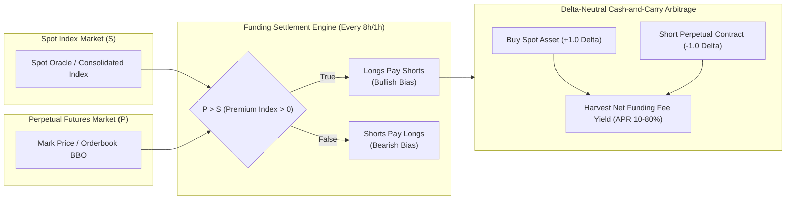
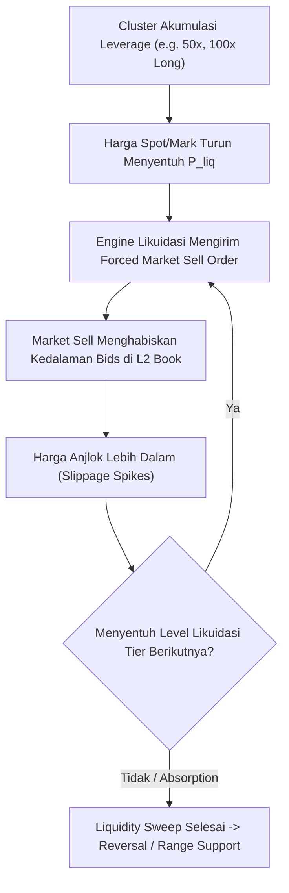
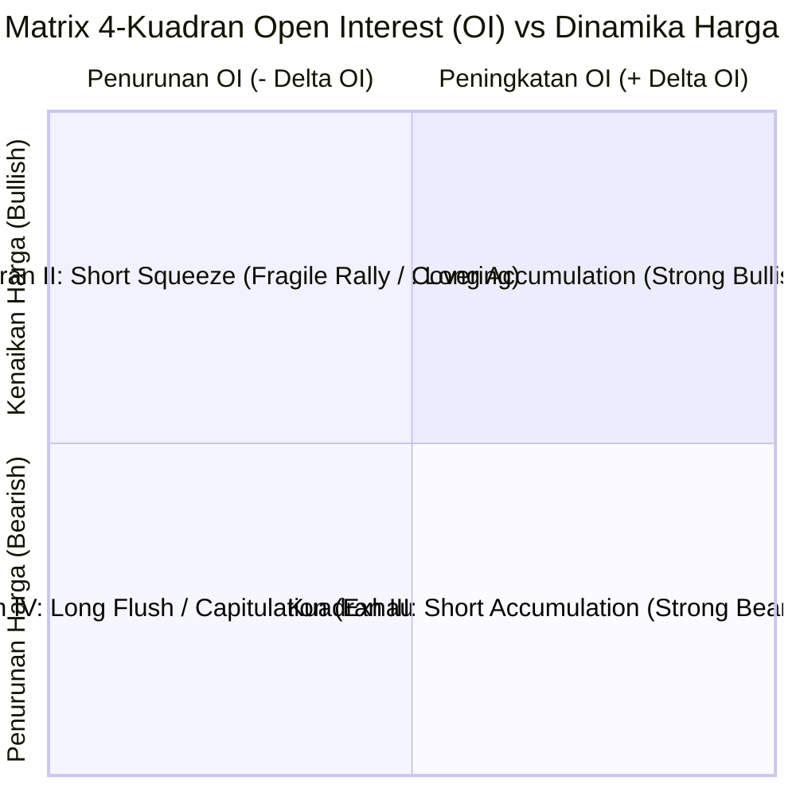
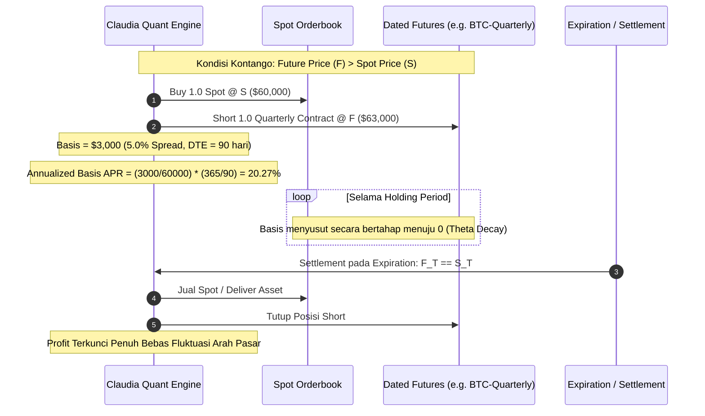

# Neuron N043: Derivatives & Futures Microstructure

Arsitektur mikrostruktur instrumen derivatif kripto dan komoditas, arbitrase *Funding Rate perpetual swap*, pemodelan kluster *Liquidation Heatmap*, divergensi *Open Interest (OI)* vs dinamika harga, analisis rasio *Long/Short (L/S)* positioning smart money, serta strategi *Cash-and-Carry Basis trading* delta-neutral berbasis *term structure*.

- **Kategori**: Quantitative Derivatives, Futures Microstructure & Delta-Neutral Yield Engines
- **Tanggal Sintesis**: 2026-08-24
- **Subgoal**: Membangun engine mikrostruktur derivatif terverifikasi untuk menangkap yield delta-neutral, mendeteksi zona likuidasi densitas tinggi (*liquidity magnets* & *cascade runs*), mengklasifikasikan 4 kuadran rezim Open Interest vs Aksi Harga, mengukur asimetri sentimen Long/Short, serta mengeksekusi konvergensi basis kontango kalender tanpa risiko arah (*zero directional exposure*).
- **Synaptic Links**: [`N004`](file:///D:/Agent_Claudia_Autonomus/learning/neurons/N004_ponytail_minimality.md), [`N009`](file:///D:/Agent_Claudia_Autonomus/learning/neurons/N009_peak_algorithms_codex.md), [`N011`](file:///D:/Agent_Claudia_Autonomus/learning/neurons/N011_mechanical_sympathy_perf.md), [`N021`](file:///D:/Agent_Claudia_Autonomus/learning/neurons/N021_quantitative_gold_crypto_trading.md), [`N025`](file:///D:/Agent_Claudia_Autonomus/learning/neurons/N025_hft_orderbook_microstructure.md), [`N033`](file:///D:/Agent_Claudia_Autonomus/learning/neurons/N033_python_high_performance.md)
- **Status**: Active Operational Invariant

---

## 🏗️ 1. Perpetual Swap Mechanics & Funding Rate Arbitrage

Perpetual swap tidak memiliki tanggal kedaluwarsa (*no expiry*). Mekanisme penjangkar harga (*price pegging mechanism*) ke harga indeks spot diatur secara deterministik melalui **Funding Rate**.



### A. Premium Index & Dynamic Funding Rate Formulation
1. **Premium Index ($P_t$)**:
   $$P_t = \frac{\max(0, P_{\text{bid}} - I_t) - \max(0, I_t - P_{\text{ask}})}{I_t}$$
   di mana $I_t$ adalah *Spot Index Price*, $P_{\text{bid}}$ dan $P_{\text{ask}}$ adalah *Impact Bid/Ask Price* dari orderbook perpetual.

2. **Perpetual Funding Rate ($F_t$) Clamping**:
   $$F_t = \text{Clamp}\left(\bar{P}_t + \text{Clamp}(r_{\text{interest}} - \bar{P}_t, -\delta, \delta), -F_{\text{cap}}, F_{\text{cap}}\right)$$
   - $\bar{P}_t$: Time-Weighted Average Premium Index (TWAP selama interval funding 8 jam atau 1 jam).
   - $r_{\text{interest}}$: Default interest rate suku bunga acuan (misal $0.01\%$ per 8 jam $= 0.03\%$ per hari).
   - $\delta$: Clamping buffer (umumnya $0.05\%$).
   - $F_{\text{cap}}$: Maximum allowable funding rate (misal $\pm 0.75\%$ per interval).

3. **Annualized Yield (APR & APY)**:
   $$\text{APR} = F \times \left(\frac{24}{H_{\text{interval}}}\right) \times 365 \times 100\%$$
   $$\text{APY} = \left[\left(1 + F\right)^{\frac{365 \times 24}{H_{\text{interval}}}} - 1\right] \times 100\%$$

4. **Biaya & Drag Arbitrase Bersih**:
   $$\text{Yield}_{\text{net}} = \text{Gross Funding} - (\text{Fee}_{\text{spot entry}} + \text{Fee}_{\text{perp entry}} + \text{Fee}_{\text{spot exit}} + \text{Fee}_{\text{perp exit}}) - \text{Borrow Cost} - \text{Slippage}$$

---

## 🌊 2. Liquidation Heatmap Clusters & Cascade Dynamics

Likuidasi posisi *leveraged* menghasilkan forced market orders yang mengeksekusi likuiditas di buku order secara agresif, sering kali memicu *cascade runs* (long squeeze atau short squeeze).



### A. Formula Deterministik Harga Likuidasi ($P_{\text{liq}}$)

1. **Isolated Margin Long Position**:
   $$P_{\text{liq, long}} = \frac{P_{\text{entry}} \cdot \left(1 - \text{IMR}\right)}{1 - \text{MMR}} = \frac{P_{\text{entry}} \cdot \left(1 - \frac{1}{\text{Lev}}\right)}{1 - \text{MMR}}$$

2. **Isolated Margin Short Position**:
   $$P_{\text{liq, short}} = \frac{P_{\text{entry}} \cdot \left(1 + \text{IMR}\right)}{1 + \text{MMR}} = \frac{P_{\text{entry}} \cdot \left(1 + \frac{1}{\text{Lev}}\right)}{1 + \text{MMR}}$$
   - $\text{IMR}$: Initial Margin Requirement $= \frac{1}{\text{Leverage}}$.
   - $\text{MMR}$: Maintenance Margin Requirement (misal $0.5\%$ untuk Tier 1, $1.0\%$ untuk Tier 2).

3. **Cross Margin Long Position (Multi-Asset / Shared Collateral)**:
   $$P_{\text{liq, cross long}} = P_{\text{entry}} - \frac{W_{\text{balance}} + \text{UPnL}_{\text{other}} - (\text{MMR} \cdot P_{\text{entry}} \cdot Q)}{Q \cdot (1 - \text{MMR})}$$
   - $W_{\text{balance}}$: Total collateral wallet equity.
   - $Q$: Position contract size.

### B. Liquidation Heatmap Density Modeling
- Kluster likuidasi dihitung dengan mengagregasikan perkiraan volume likuidasi pada setiap bucket harga $k$:
  $$D(P_k) = \sum_{i \in \text{Positions}} \text{Vol}_i \cdot \mathcal{K}\left(\frac{P_k - P_{\text{liq}, i}}{h}\right)$$
- Di mana $\mathcal{K}$ adalah fungsi Gaussian kernel smoothing dan $h$ adalah bandwidth harga. Kluster densitas tertinggi bertindak sebagai **magnet likuiditas** bagi market maker institusional sebelum terjadi pembalikan tren (*mean reversion liquidity sweep*).

---

## 📊 3. Open Interest (OI) vs. Price Action Divergence Matrix

*Open Interest (OI)* merefleksikan total nilai kontrak derivatif terbuka yang belum diselesaikan. Kombinasi pergerakan harga dan fluktuasi OI membentuk 4 kuadran rezim mikrostruktur fundamental.



### Taksonomi 4 Kuadran Rezim OI

| Rezim | Arah Harga ($\Delta P$) | Arah OI ($\Delta \text{OI}$) | Interpretasi Mikrostruktur | Tindakan Kuantitatif Claudia |
| :--- | :--- | :--- | :--- | :--- |
| **Kuadran I** | Naik ($\uparrow$) | Naik ($\uparrow$) | **Agresif Long Inflow**: Uang baru masuk membuka posisi long. Tren bullish sangat valid & kuat. | *Trend-Following Long* / *Hold Delta-Neutral*. |
| **Kuadran II** | Naik ($\uparrow$) | Turun ($\downarrow$) | **Short Squeeze / Forced Covering**: Kenaikan dipicu oleh likuidasi short, bukan akumulasi murni. Rentan *fade*. | *Prepare Short Fade at Liquidation Cluster*. |
| **Kuadran III** | Turun ($\downarrow$) | Naik ($\uparrow$) | **Agresif Short Inflow**: Penjual membuka posisi short baru. Tekanan jual institusional dominan. | *Trend-Following Short* / *Avoid Long Knives*. |
| **Kuadran IV** | Turun ($\downarrow$) | Turun ($\downarrow$) | **Long Liquidation / Panic Capitulation**: Long tertutup karena stop-loss/likuidasi massal. Menandakan *exhaustion*. | *Look for Absorption & Reversal Long Entry*. |

---

## ⚖️ 4. Long/Short Ratio & Positioning Sentiment Skew

Analisis posisi membedakan antara rasio akun ritel (*Global Account Long/Short Ratio*) dan rasio posisi smart money (*Top Trader Position Long/Short Ratio*).

```mermaid
flowchart LR
    subgraph DataFeeds ["Derivatives Sentiment Feeds"]
        GlobalAcc["Global Account L/S Ratio (Retail Crowd)"]
        TopPosition["Top Trader Position L/S Ratio (Whales/Funds)"]
        FundingHist["Historical Funding Rate Z-Score"]
    end

    subgraph SkewEngine ["Asymmetry & Squeeze Probability Analyzer"]
        CalcSkew["Calculate Divergence:\nSkew = Top_Pos_Ratio - Global_Acc_Ratio"]
        ZScore["Normalize Positioning Z-Score:\nZ = (Ratio - Mean) / StdDev"]
    end

    subgraph StrategyDecision ["Trading Decision & Risk Mitigation"]
        BullTrap["Z > +2.0 & High Pos Funding -> High Risk Long Squeeze"]
        BearTrap["Z < -2.0 & Heavy Neg Funding -> High Prob Short Squeeze"]
        Neutral["|Z| <= 1.0 -> Normal Market Condition"]
    end

    DataFeeds --> SkewEngine
    SkewEngine --> StrategyDecision
```



### A. Metrik & Rasio Positioning
1. **Global Account Long/Short Ratio ($R_{\text{global}}$)**:
   $$R_{\text{global}} = \frac{N_{\text{accounts long}}}{N_{\text{accounts short}}}$$
2. **Top Trader Position Ratio ($R_{\text{top}}$)**:
   $$R_{\text{top}} = \frac{\sum V_{\text{top long}}}{\sum V_{\text{top short}}}$$
3. **Contrarian Skew Signal ($S_t$)**:
   $$S_t = \frac{R_{\text{top}} - R_{\text{global}}}{\sigma_R}$$
   - Jika $R_{\text{global}} \gg 2.5$ (ritel mayoritas long) namun $R_{\text{top}} < 1.0$ (whale pasang short) didukung funding rate positif tinggi, terjadi **asimetri probabilitas likuidasi long ke bawah** (*high probability long liquidation cascade*).

---

## ⏳ 5. Cash-and-Carry Basis Trading (Term Structure & Calendar Futures)

Strategi arbitrase bebas risiko arah (*delta-neutral*) yang mengeksploitasi selisih harga (*basis*) antara *Dated Futures* (kontrak berjangka bertanggal) dan *Spot*.



### A. Formula Valuasi Basis & Imbal Hasil Tahunan
1. **Basis Spread Nominal & Persentase**:
   $$\text{Basis}_{\$} = F - S, \quad \text{Basis}_{\%} = \frac{F - S}{S}$$
2. **Annualized Basis Yield ($\text{APR}_{\text{basis}}$)**:
   $$\text{APR}_{\text{basis}} = \left(\frac{F - S}{S}\right) \times \left(\frac{365}{\text{DTE}}\right) \times 100\% - \text{Total Round-Trip Friction Fee}$$
   di mana $\text{DTE}$ (*Days to Expiration*) adalah sisa hari menuju tanggal penyelesaian (*expiry*).
3. **Term Structure Regimes**:
   - **Contango ($F > S$)**: Kurva normal. Strategi: *Long Spot + Short Futures* (eksekusi Cash-and-Carry standar).
   - **Backwardation ($F < S$)**: Terjadi saat krisis likuiditas spot mendesak. Strategi: *Reverse Cash-and-Carry* (Short Spot via margin borrow + Long Futures).

---

## 💻 Zero-Dependency Stdlib Python Implementation & Self-Check

Modul produksi pure standard library Python yang mengimplementasikan seluruh formula kuantitatif: kalkulasi funding rate yield, margin & liquidation cluster simulation, 4-kuadran klasifikasi Open Interest, Long/Short asymmetry index, dan Cash-and-Carry term structure engine.

```python
"""
Neuron N043: Derivatives & Futures Microstructure Engine.
Standard library only (math, typing, dataclasses, statistics). Deterministic validation suite.
"""

from dataclasses import dataclass
from typing import Dict, List, Optional, Tuple
import math
import statistics

@dataclass(frozen=True)
class PositionTier:
    """Margin requirement tier based on notional size."""
    max_notional: float
    mmr: float  # Maintenance Margin Requirement
    imr: float  # Initial Margin Requirement (1 / Max Leverage)

class DerivativesMicrostructureEngine:
    """Core quantitative derivatives microstructure engine."""

    # Default BTC/Crypto style margin tiers
    DEFAULT_TIERS = [
        PositionTier(max_notional=50_000.0, mmr=0.005, imr=0.01),    # 100x max
        PositionTier(max_notional=250_000.0, mmr=0.010, imr=0.02),   # 50x max
        PositionTier(max_notional=1_000_000.0, mmr=0.025, imr=0.05), # 20x max
        PositionTier(max_notional=10_000_000.0, mmr=0.050, imr=0.10) # 10x max
    ]

    # --- 1. FUNDING RATE ARBITRAGE CALCULATIONS ---
    @staticmethod
    def calculate_premium_index(impact_bid: float, impact_ask: float, index_price: float) -> float:
        """Calculates instantaneous premium index P_t."""
        if index_price <= 0:
            raise ValueError("Index price must be strictly positive.")
        bid_premium = max(0.0, impact_bid - index_price)
        ask_premium = max(0.0, index_price - impact_ask)
        return (bid_premium - ask_premium) / index_price

    @staticmethod
    def calculate_clamped_funding_rate(
        twap_premium_index: float,
        interest_rate: float = 0.0003, # 0.03% daily default (0.01% per 8h)
        clamp_buffer: float = 0.0005,   # +/- 0.05%
        cap: float = 0.0075             # +/- 0.75% max cap
    ) -> float:
        """Calculates clamped perpetual funding rate."""
        diff = interest_rate - twap_premium_index
        clamped_diff = max(-clamp_buffer, min(clamp_buffer, diff))
        raw_rate = twap_premium_index + clamped_diff
        return max(-cap, min(cap, raw_rate))

    @staticmethod
    def calculate_funding_yield(
        funding_rate: float,
        interval_hours: int = 8,
        leverage: float = 1.0,
        roundtrip_fee_pct: float = 0.0008 # 0.08% maker/taker total fee
    ) -> Tuple[float, float, float]:
        """
        Returns (APR_gross, APR_net, APY_compounded) in percentage (e.g. 15.5 for 15.5%).
        """
        if interval_hours <= 0:
            raise ValueError("Interval hours must be positive.")
        settlements_per_year = (24.0 / interval_hours) * 365.0
        apr_gross = funding_rate * settlements_per_year * leverage * 100.0
        
        # Friction fee annualized over estimated 30-day holding horizon
        fee_drag_apr = (roundtrip_fee_pct * (365.0 / 30.0)) * 100.0
        apr_net = apr_gross - fee_drag_apr
        
        # APY compounded
        if funding_rate > -1.0:
            apy = ((1.0 + funding_rate * leverage) ** settlements_per_year - 1.0) * 100.0
        else:
            apy = -100.0
            
        return apr_gross, apr_net, apy

    # --- 2. LIQUIDATION ENGINE & HEATMAP ---
    @classmethod
    def get_tier_mmr(cls, notional: float, tiers: Optional[List[PositionTier]] = None) -> float:
        """Retrieves applicable MMR for a given notional position size."""
        tier_list = tiers or cls.DEFAULT_TIERS
        for t in tier_list:
            if notional <= t.max_notional:
                return t.mmr
        return tier_list[-1].mmr

    @classmethod
    def calculate_isolated_liquidation_price(
        cls,
        entry_price: float,
        leverage: float,
        side: str,
        notional: float,
        tiers: Optional[List[PositionTier]] = None
    ) -> float:
        """Calculates deterministic isolated margin liquidation price."""
        if entry_price <= 0 or leverage <= 0:
            raise ValueError("Entry price and leverage must be positive.")
        
        mmr = cls.get_tier_mmr(notional, tiers)
        imr = 1.0 / leverage
        
        if side.lower() == "long":
            # P_liq = P_entry * (1 - IMR) / (1 - MMR)
            denom = 1.0 - mmr
            if denom <= 0:
                raise ZeroDivisionError("MMR cannot be >= 1.0")
            return entry_price * (1.0 - imr) / denom
        elif side.lower() == "short":
            # P_liq = P_entry * (1 + IMR) / (1 + MMR)
            denom = 1.0 + mmr
            return entry_price * (1.0 + imr) / denom
        else:
            raise ValueError(f"Unknown side: {side}. Must be 'long' or 'short'.")

    @classmethod
    def calculate_cross_liquidation_price(
        cls,
        entry_price: float,
        position_size: float,
        wallet_balance: float,
        side: str,
        maintenance_margin_rate: float = 0.005
    ) -> float:
        """
        Calculates cross-margin liquidation price given total wallet balance.
        Formula Long: P_liq = Entry - (Wallet - MMR * Entry * Q) / (Q * (1 - MMR))
        """
        if position_size <= 0 or entry_price <= 0:
            raise ValueError("Position size and entry price must be positive.")
        
        mmr = maintenance_margin_rate
        q = position_size
        notional = entry_price * q
        
        if side.lower() == "long":
            buffer_val = wallet_balance - (mmr * notional)
            p_liq = entry_price - (buffer_val / (q * (1.0 - mmr)))
            return max(0.0, p_liq)
        elif side.lower() == "short":
            buffer_val = wallet_balance - (mmr * notional)
            p_liq = entry_price + (buffer_val / (q * (1.0 + mmr)))
            return p_liq
        else:
            raise ValueError(f"Unknown side: {side}")

    @staticmethod
    def estimate_liquidation_cluster_density(
        current_price: float,
        open_positions: List[Dict[str, float]], # List of dicts: {"entry": p, "size": q, "lev": l, "side": "long"/"short"}
        price_bins: List[float],
        bandwidth_pct: float = 0.01 # 1% Gaussian smoothing window
    ) -> Dict[float, float]:
        """
        Constructs a smoothed Liquidation Heatmap density across discrete price bins.
        """
        densities: Dict[float, float] = {p_bin: 0.0 for p_bin in price_bins}
        
        # 1. Compute liquidation price for each position
        liq_points: List[Tuple[float, float]] = [] # (p_liq, volume_notional)
        for pos in open_positions:
            imr = 1.0 / pos["lev"]
            mmr = 0.005
            p_entry = pos["entry"]
            notional = p_entry * pos["size"]
            
            if pos["side"].lower() == "long":
                p_liq = p_entry * (1.0 - imr) / (1.0 - mmr)
            else:
                p_liq = p_entry * (1.0 + imr) / (1.0 + mmr)
            liq_points.append((p_liq, notional))
            
        # 2. Kernel density estimate onto bins
        h = current_price * bandwidth_pct
        for p_bin in price_bins:
            total_density = 0.0
            for p_liq, vol in liq_points:
                u = (p_bin - p_liq) / h
                # Gaussian kernel: (1 / sqrt(2*pi)) * exp(-0.5 * u^2)
                kernel_val = (1.0 / math.sqrt(2.0 * math.pi)) * math.exp(-0.5 * u * u)
                total_density += vol * kernel_val
            densities[p_bin] = total_density
            
        return densities

    # --- 3. OPEN INTEREST (OI) & PRICE DIVERGENCE REGIMES ---
    @staticmethod
    def classify_oi_price_regime(
        price_delta_pct: float,
        oi_delta_pct: float,
        deadband_pct: float = 0.002
    ) -> Tuple[str, str]:
        """
        Classifies market state into 4 fundamental microstructure quadrants:
        - Quadrant 1: LONG_BUILDUP (Price UP, OI UP)
        - Quadrant 2: SHORT_SQUEEZE (Price UP, OI DOWN)
        - Quadrant 3: SHORT_BUILDUP (Price DOWN, OI UP)
        - Quadrant 4: LONG_FLUSH_CAPITULATION (Price DOWN, OI DOWN)
        """
        p_up = price_delta_pct > deadband_pct
        p_down = price_delta_pct < -deadband_pct
        oi_up = oi_delta_pct > deadband_pct
        oi_down = oi_delta_pct < -deadband_pct
        
        if p_up and oi_up:
            return "LONG_BUILDUP", "Aggressive buyer accumulation. Sustained trend strength."
        elif p_up and oi_down:
            return "SHORT_SQUEEZE", "Forced short covering / stop run. Vulnerable to sharp reversal."
        elif p_down and oi_up:
            return "SHORT_BUILDUP", "Aggressive seller initiation. Strong bearish continuation."
        elif p_down and oi_down:
            return "LONG_FLUSH_CAPITULATION", "Forced long liquidation cascade. Potential bottom exhaustion."
        else:
            return "CHOP_RANGE", "Indeterminate consolidation within noise deadband."

    # --- 4. LONG/SHORT RATIO & SENTIMENT SKEW ---
    @staticmethod
    def calculate_positioning_zscore(
        current_ratio: float,
        historical_ratios: List[float]
    ) -> float:
        """Calculates normalized Z-score of Long/Short sentiment ratio."""
        if len(historical_ratios) < 2:
            return 0.0
        mean = statistics.mean(historical_ratios)
        stdev = statistics.stdev(historical_ratios)
        if stdev == 0.0:
            return 0.0
        return (current_ratio - mean) / stdev

    @staticmethod
    def detect_sentiment_asymmetry(
        top_trader_ratio: float,
        global_account_ratio: float,
        z_score: float
    ) -> Dict[str, any]:
        """
        Detects positioning divergence between retail crowd and smart money.
        """
        # Skew: Top Trader (Whales) vs Global Accounts (Retail)
        divergence = top_trader_ratio - global_account_ratio
        is_crowded_long = global_account_ratio > 2.0 and z_score > 1.8
        is_crowded_short = global_account_ratio < 0.6 and z_score < -1.8
        
        trap_risk = "NONE"
        if is_crowded_long and top_trader_ratio < 1.0:
            trap_risk = "HIGH_PROBABILITY_LONG_SQUEEZE_DOWN"
        elif is_crowded_short and top_trader_ratio > 1.2:
            trap_risk = "HIGH_PROBABILITY_SHORT_SQUEEZE_UP"
            
        return {
            "divergence": divergence,
            "is_crowded_long": is_crowded_long,
            "is_crowded_short": is_crowded_short,
            "trap_risk": trap_risk
        }

    # --- 5. CASH-AND-CARRY BASIS TRADING ENGINE ---
    @staticmethod
    def calculate_basis_metrics(
        spot_price: float,
        futures_price: float,
        days_to_expiration: float,
        spot_taker_fee: float = 0.0004,
        futures_taker_fee: float = 0.0004
    ) -> Dict[str, float]:
        """
        Calculates Cash-and-Carry calendar basis, curve structure, and net annualized yield.
        """
        if spot_price <= 0 or futures_price <= 0 or days_to_expiration <= 0:
            raise ValueError("Prices and DTE must be strictly positive.")
            
        basis_nominal = futures_price - spot_price
        basis_pct = (basis_nominal / spot_price) * 100.0
        
        # Annualized basis yield (APR)
        annualization_factor = 365.0 / days_to_expiration
        gross_apr = (basis_nominal / spot_price) * annualization_factor * 100.0
        
        # Round-trip transaction fee friction (Enter spot & perp + Exit spot & perp = 4 legs)
        total_fee_friction_pct = (spot_taker_fee + futures_taker_fee) * 2.0 * 100.0
        net_apr = gross_apr - total_fee_friction_pct
        
        is_contango = futures_price > spot_price
        
        return {
            "basis_nominal": basis_nominal,
            "basis_pct": basis_pct,
            "gross_apr": gross_apr,
            "net_apr": net_apr,
            "is_contango": 1.0 if is_contango else 0.0
        }


# =====================================================================
# INVARIANT VERIFICATION SUITE
# =====================================================================
def run_neuron_tests():
    """Deterministic validation test suite for Neuron N043."""
    print("  [>] Running Neuron N043 Invariant Tests...")
    engine = DerivativesMicrostructureEngine()

    # 1. Premium Index & Clamped Funding Rate Tests
    p_index = engine.calculate_premium_index(impact_bid=60020.0, impact_ask=60030.0, index_price=60000.0)
    assert p_index > 0, "Premium index should be positive when perp trades above spot index."
    
    # Normal funding clamping
    rate_normal = engine.calculate_clamped_funding_rate(twap_premium_index=0.0002)
    assert abs(rate_normal - 0.0003) < 1e-6, f"Expected 0.0003, got {rate_normal}"
    
    # Cap test (+0.75% max cap)
    rate_extreme = engine.calculate_clamped_funding_rate(twap_premium_index=0.02)
    assert rate_extreme == 0.0075, f"Funding rate must be capped at 0.0075, got {rate_extreme}"
    
    # 2. Funding Yield (APR/APY)
    apr_g, apr_n, apy = engine.calculate_funding_yield(funding_rate=0.0005, interval_hours=8, leverage=1.0)
    # 0.05% per 8h = 0.15% per day -> * 365 = 54.75% APR
    assert abs(apr_g - 54.75) < 1e-2, f"Expected ~54.75% APR, got {apr_g}"
    assert apr_n < apr_g, "Net APR must reflect transaction fee drag."
    assert apy > apr_g, f"Compounded APY ({apy}) must exceed nominal APR ({apr_g})."

    # 3. Isolated Liquidation Pricing Invariants
    # 10x Long on $50,000 entry -> IMR=0.10, MMR=0.005 -> P_liq = 50000 * (1 - 0.10) / (1 - 0.005) = 45000 / 0.995 = 45226.13
    p_liq_long = engine.calculate_isolated_liquidation_price(
        entry_price=50000.0, leverage=10.0, side="long", notional=50000.0
    )
    expected_long_liq = 50000.0 * 0.90 / 0.995
    assert abs(p_liq_long - expected_long_liq) < 1e-2, f"Unexpected Long P_liq: {p_liq_long}"
    assert p_liq_long < 50000.0, "Long liquidation price must be strictly below entry price."

    # 10x Short on $50,000 entry -> IMR=0.10, MMR=0.005 -> P_liq = 50000 * (1 + 0.10) / (1 + 0.005) = 55000 / 1.005 = 54726.36
    p_liq_short = engine.calculate_isolated_liquidation_price(
        entry_price=50000.0, leverage=10.0, side="short", notional=50000.0
    )
    expected_short_liq = 50000.0 * 1.10 / 1.005
    assert abs(p_liq_short - expected_short_liq) < 1e-2, f"Unexpected Short P_liq: {p_liq_short}"
    assert p_liq_short > 50000.0, "Short liquidation price must be strictly above entry price."

    # 4. Cross Margin Liquidation Invariant
    # Entry 60,000, 1.0 BTC position, 10,000 USD wallet collateral, MMR=0.005
    p_liq_cross = engine.calculate_cross_liquidation_price(
        entry_price=60000.0, position_size=1.0, wallet_balance=10000.0, side="long", maintenance_margin_rate=0.005
    )
    # buffer = 10000 - (0.005 * 60000) = 10000 - 300 = 9700. p_liq = 60000 - (9700 / 0.995) = 60000 - 9748.74 = 50251.25
    assert 50250.0 < p_liq_cross < 50255.0, f"Cross liq out of bounds: {p_liq_cross}"

    # 5. Liquidation Heatmap Density
    mock_positions = [
        {"entry": 60000.0, "size": 2.0, "lev": 50.0, "side": "long"},   # liq ~ 58900
        {"entry": 60000.0, "size": 5.0, "lev": 20.0, "side": "long"},   # liq ~ 57200
        {"entry": 60000.0, "size": 1.0, "lev": 100.0, "side": "short"}, # liq ~ 60500
    ]
    bins = [57000.0, 58000.0, 58900.0, 60000.0, 60500.0]
    densities = engine.estimate_liquidation_cluster_density(60000.0, mock_positions, bins)
    assert densities[58900.0] > densities[60000.0], "Cluster at 58900 must have higher density than flat 60000."

    # 6. Open Interest 4-Quadrant Classification
    regime_1, _ = engine.classify_oi_price_regime(price_delta_pct=0.03, oi_delta_pct=0.05)
    assert regime_1 == "LONG_BUILDUP", f"Expected LONG_BUILDUP, got {regime_1}"
    
    regime_2, _ = engine.classify_oi_price_regime(price_delta_pct=0.04, oi_delta_pct=-0.03)
    assert regime_2 == "SHORT_SQUEEZE", f"Expected SHORT_SQUEEZE, got {regime_2}"

    regime_3, _ = engine.classify_oi_price_regime(price_delta_pct=-0.05, oi_delta_pct=0.04)
    assert regime_3 == "SHORT_BUILDUP", f"Expected SHORT_BUILDUP, got {regime_3}"

    regime_4, _ = engine.classify_oi_price_regime(price_delta_pct=-0.06, oi_delta_pct=-0.08)
    assert regime_4 == "LONG_FLUSH_CAPITULATION", f"Expected LONG_FLUSH_CAPITULATION, got {regime_4}"

    # 7. Long/Short Sentiment Asymmetry & Z-Score
    hist_ratios = [1.1, 1.2, 1.15, 1.05, 1.25, 1.18, 1.22]
    z_val = engine.calculate_positioning_zscore(current_ratio=2.6, historical_ratios=hist_ratios)
    assert z_val > 2.0, f"Z-score for extreme 2.6 ratio should be > 2.0, got {z_val}"
    
    sentiment_diag = engine.detect_sentiment_asymmetry(
        top_trader_ratio=0.8, global_account_ratio=2.7, z_score=z_val
    )
    assert sentiment_diag["trap_risk"] == "HIGH_PROBABILITY_LONG_SQUEEZE_DOWN", "Expected long squeeze risk trap."

    # 8. Cash-and-Carry Basis Trading
    # Spot 60,000, Futures 63,000 (DTE=90 days)
    basis_res = engine.calculate_basis_metrics(spot_price=60000.0, futures_price=63000.0, days_to_expiration=90.0)
    assert basis_res["is_contango"] == 1.0, "Futures > Spot must be Contango."
    assert abs(basis_res["basis_pct"] - 5.0) < 1e-4, f"Basis pct expected 5.0%, got {basis_res['basis_pct']}"
    # Gross APR = 5% * (365 / 90) = 20.277%
    assert abs(basis_res["gross_apr"] - 20.277) < 0.01, f"Gross APR calculation mismatch: {basis_res['gross_apr']}"
    assert basis_res["net_apr"] > 19.5, "Net APR after fee deductions should remain attractive."

    print("  [+] Neuron N043 Invariants Verified: Funding Arbitrage, Liquidation Clusters, OI Matrix, L/S Asymmetry & Basis Engine.")

if __name__ == "__main__":
    run_neuron_tests()
```

---

## 🔒 Invarian Operasional & Disiplin Eksekusi
1. **Delta-Neutrality Maintenance**: Monitor posisi spot dan short perpetual/futures secara kontinu. Lakukan penyesuaian (*rebalancing*) jika delta portofolio bergeser $|\Delta_{\text{net}}| > 0.02$ akibat eksekusi parsial atau perubahan nilai kolateral.
2. **Margin Health Buffer**: Pertahankan rasio margin kolateral minimal $3.0\times$ di atas $MMR$ untuk mencegah *forced liquidation* pada kaki short saat terjadi lonjakan harga spot yang tajam (*parabolic spike*).
3. **Liquidation Cascade Non-Interference**: Jangan pernah mencoba menangkap pisau jatuh (*knife-catching*) di tengah fase *Long Flush Capitulation* sebelum terjadi absorpsi volume yang divalidasi oleh penurunan volume likuidasi dan reset OI.
4. **Funding Drag Ceiling**: Hindari membuka posisi arbitrase perpetual jika estimasi imbal hasil funding rate $\text{APR}_{\text{net}} < 8.0\%$ setelah memperhitungkan *round-trip fees* dan biaya pinjam (*borrow interest*).
